# Videoflow 产品需求文档(PRD)

> **项目名称**:Videoflow
> **文档版本**:v0.1
> **文档语言**:中文(英文版待本版定稿后翻译)
> **最后更新**:2026-04-19
> **文档状态**:草案 · 待评审
> **许可证**:MIT

---

## 目录

- [第零部分 · 前置信息](#第零部分--前置信息)
- [第一部分 · 产品概述](#第一部分--产品概述)
- [第二部分 · 设计原则与系统约束](#第二部分--设计原则与系统约束)
- [第三部分 · 系统架构](#第三部分--系统架构)
- [第四部分 · 核心数据模型](#第四部分--核心数据模型)
- [第五部分 · 核心业务流程](#第五部分--核心业务流程)
- (第六~十二部分见后续分卷)

---

## 第零部分 · 前置信息

### 0.1 文档版本历史

| 版本 | 日期 | 作者 | 变更摘要 |
|------|------|------|---------|
| v0.1 | 2026-04-19 | Videoflow 项目组 | 初版草稿 |

### 0.2 术语表

| 术语 | 英文 | 含义 |
|------|------|------|
| 分镜 | Shot | 视频最小执行单位,含时长、旁白、画面规格 |
| 场景 | Scene | 多个分镜组成的逻辑段落(开场、论证、结尾) |
| 项目 | Project | 一次完整的"文本→视频"任务,状态持久化 |
| 模板 | Template | 内容类型配置(explainer / news_digest 等) |
| 执行器 | Executor | 负责一类画面生成的模块(Chart、Diagram、TTS) |
| 提供商插件 | Provider | 同一能力的可替换实现(edge-tts / azure-tts) |
| 渲染器 | Renderer | 底层画面合成引擎(Mermaid / Remotion / Playwright) |
| 检查点 | Checkpoint | LangGraph 状态持久化的快照 |
| 中断 | Interrupt | LangGraph 挂起流水线等待外部事件的机制 |
| 审核 | Review | 人工对中间产物的确认动作 |
| MCP 服务 | MCP Server | 遵循 Model Context Protocol 暴露工具能力的独立进程 |
| LangGraph 节点 | Node | 编排图中的一个处理单元 |
| 工作区 | Workspace | 项目文件存放根目录(`workspace/{project_id}/`) |

### 0.3 阅读指南

| 角色 | 建议阅读章节 |
|------|-------------|
| 产品决策者 | 第 1、2、10 部分 |
| 开发工程师 | 第 3、4、5、6、7 部分 |
| 运维/发布 | 第 7、8、10 部分 |
| 社区贡献者 | 第 6、9 部分 |
| 评审/质量 | 第 2、8、11 部分 |

---

## 第一部分 · 产品概述

### 1.1 项目背景

#### 1.1.1 短视频内容创作的工程化缺口

短视频平台(抖音、YouTube Shorts、B 站竖屏)已成为知识传播主渠道,但内容创作仍然高度依赖**手工剪辑工具**(剪映、Premiere)。典型的"知识科普类"短视频制作流程是:

- 写文案(30 分钟)
- 找配图/画图表(60 分钟)
- 录音或找 TTS(20 分钟)
- 剪辑/加字幕(90 分钟)
- 导出发布(10 分钟)

**总耗时 3-4 小时/条**。其中"找图/画图表"和"剪辑"两步占 60% 时间,且高度重复、可工程化。

#### 1.1.2 现有开源方案的定位空白

截至 2026 年 4 月,主流开源项目各有侧重,均未覆盖"**精准数据可视化 + 全流程可审可控 + 工业化工程形态**"的组合:

| 项目 | 定位 | 核心限制 |
|------|------|---------|
| MoneyPrinterTurbo | 主题 → 库存素材拼接视频 | 图表/流程图场景无法精准表达 |
| NarratoAI | 给已有视频配解说 | 方向相反(视频先行而非文本先行) |
| ViMax / UniVA | 叙事电影级多镜头生成 | 目标是角色一致性,不适合数据类科普 |
| MotionAgent | 剧本 → 剧照 → AI 视频 | 需要 GPU,生成式视频对数字不精确 |
| Remotion | 程序化视频框架 | 纯基础设施,无 Agent 编排,无流水线 |

#### 1.1.3 Videoflow 的差异化主张

Videoflow 面向"**数据驱动、文本先行、图表精准**"的科普/新闻短视频场景,提供**端到端工程化流水线**:

- 输入结构化文本 → 输出可发布 MP4
- 以 **LangGraph 状态机 + MCP 工具协议**为架构底座
- 全链路**仅 1 次可选人工审核**(分镜稿),其余全自动
- **FFmpeg 字符串拼接合成**,无 MoviePy 依赖,工业化稳定
- **MIT 许可**开源,5 分钟跑通第一条视频

### 1.2 产品愿景

#### 1.2.1 一句话定义

> **文本输入 · 视频输出 · 人工最少 · 全程可追溯**

#### 1.2.2 目标用户

**主要用户**:

- 科普内容创作者(财经、科技、知识类,需要精确图表)
- 新闻摘要自媒体(需要批量生产日更/周更内容)
- 开发者/插件贡献者(希望通过扩展 Provider 或 Template 满足定制需求)

**次要用户**:

- Claude Code / Hermes Agent 用户(通过 Skill / MCP 集成调用)
- 企业内容团队(私有部署用于内部培训/宣传视频)

#### 1.2.3 不服务的用户(边界)

- 影视叙事/剧情短片创作者(应使用 ViMax / Runway)
- 真人口播/带货数字人需求(应使用 HeyGen / Wan2.2-S2V)
- 电影级视觉效果追求者(应使用 After Effects / DaVinci)
- 无编程能力用户(V1 需要 CLI 和 YAML 配置能力)

### 1.3 核心价值主张

| 价值 | 具体体现 | 可度量指标 |
|------|---------|-----------|
| **自动化** | Light 模式仅需 1 次点击 | 人工耗时 < 3 分钟/条 |
| **工业化** | 纯 FFmpeg + 纯状态机 | 可重入、可恢复、零已知内存泄漏 |
| **可扩展** | MCP 插件体系 | 新增 Provider < 100 行代码 |
| **开源友好** | MIT + 双语文档 | 首次使用到产出视频 ≤ 15 分钟 |
| **精准** | Mermaid + Remotion 程序化图表 | 数据误差零,样式可复用 |

### 1.4 MVP 范围与非目标

#### 1.4.1 MVP(V1.0)包含

- ✅ 两种模板:`explainer`(科普反常识)+ `news_digest`(新闻摘要)
- ✅ 三档审核模式:Auto / Light / Deep
- ✅ 三套入口:CLI / Claude Code Skill / Streamlit 审核 UI
- ✅ 八个 MCP Server(见 §6.3)
- ✅ 四类 Provider 插件:TTS / LLM / Subtitle-Align / Stock
- ✅ 双语 README(中文详版 + 英文版)
- ✅ 一键 Docker compose 部署
- ✅ 《股市反常识》实战样例

#### 1.4.2 MVP 不包含(推迟到 V1.5 / V2)

- ❌ 抖音/YouTube 自动发布(合规风险)
- ❌ 卡通主持人 / 数字人(HeyGen / Wan2.2-S2V 留 V1.5)
- ❌ 生成式视频大模型(LTX / Sora 留 V2)
- ❌ 多用户权限与云端 SaaS 部署
- ❌ 经验自学习 Skill Distiller(V1.5)
- ❌ 自动 Memory Curation(V2)

---

## 第二部分 · 设计原则与系统约束

### 2.1 六条核心设计原则

```
原则 1  AI 优先,人工兜底
        能自动生成的绝不依赖人工,人工只做"确认/拒绝",不做"从零创作"

原则 2  开源生态优先,不重造轮子
        优先选用成熟的开源组件,避免自研;LangGraph / MCP / FFmpeg / LangExtract

原则 3  MCP 协议解耦工具
        所有外部工具通过 MCP Server 暴露,可独立部署、独立替换、社区贡献

原则 4  模块独立可测
        每个 Node / MCP Server / Provider 可独立运行、独立测试、独立替换

原则 5  简单优于复杂
        能用 FFmpeg 命令解决的不用 MoviePy,能用 CLI 的不用 API,能声明式的不用命令式

原则 6  开箱即用
        clone → pip install → 配置 API Key → 5 分钟跑出第一条视频
```

### 2.2 非功能性需求(NFR)

| 维度 | 目标 | 度量方式 |
|------|------|---------|
| **性能** | 60 秒视频端到端 ≤ 10 分钟 | CI 基准测试,90 百分位 |
| **成本** | 单条视频 LLM + TTS ≤ ¥0.5 | 以 Claude Sonnet + edge-tts 为基准 |
| **可恢复性** | 任意中断可从最近 checkpoint 恢复 | 测试覆盖所有 Node 退出场景 |
| **可观测性** | 每次运行 100% LangGraph trace | Trace 落盘 JSONL |
| **可移植性** | Linux / macOS / WSL2 完整支持 | CI 矩阵覆盖三平台 |
| **稳定性** | 30 天运行无内存泄漏 | 长跑测试(M4 阶段) |
| **可配置性** | 90% 行为可通过 `config.toml` 调整 | 配置覆盖率评审 |
| **向后兼容** | Shot JSON Schema 在 V1.x 内保持向后兼容 | Schema 版本号强制 |

### 2.3 技术栈总览

| 层级 | 组件 | 版本 | 用途 | License | 替代方案 |
|------|------|------|------|---------|---------|
| **运行时** | Python | 3.11+ | 主干语言 | PSF | — |
| | Node.js | 20+ | Remotion 渲染 | MIT | — |
| | FFmpeg | 6.0+ | 视频合成 | LGPL | — |
| **编排** | LangGraph | latest | 状态机 / 流水线 | MIT | — |
| | LiteLLM | latest | LLM 抽象层 | MIT | 原生 SDK |
| **解析** | LangExtract | latest | 文本→结构化 | Apache 2.0 | 原生 LLM + Pydantic |
| **工具协议** | MCP | 1.x | 插件接口 | MIT | — |
| **渲染** | Mermaid-CLI | 10+ | 流程图/架构图 | MIT | Graphviz / PlantUML |
| | Remotion | 4+ | 动画图表/动态文字 | 特殊(见下) | Motion Canvas |
| | Playwright | 1.x | HTML/CSS 动画录制 | Apache 2.0 | Puppeteer |
| **音频** | edge-tts | latest | 默认 TTS | MIT | Azure TTS / ElevenLabs |
| | Paraformer-Large | v2 | 默认字幕对齐(中文) | Apache 2.0 | faster-whisper |
| | faster-whisper | latest | 备选字幕对齐(多语) | MIT | 原生 whisper |
| **素材** | Pexels API | — | 免费视频素材 | Pexels 授权 | Pixabay |
| **合成** | FFmpeg(纯命令) | 6.0+ | 最终合成 | LGPL | MoviePy(仅开发调试) |
| **持久化** | SQLite | 3 | 状态/队列 | Public Domain | PostgreSQL |
| **审核 UI** | Streamlit | 1.x | 审核界面 | Apache 2.0 | FastAPI + React |
| **配置** | TOML / YAML / Pydantic | — | 配置管理 | MIT | — |
| **打包** | uv | latest | 依赖管理 | MIT | pip + venv |

**License 风险说明**:
- Remotion 对年收入 $1M+ 的公司需要购买企业许可,个人用户和 $1M 以下公司免费使用。Videoflow 作为开源项目不传递此义务给最终用户,但企业使用者需自行审计。
- FFmpeg 本身 LGPL,但若启用 libx264/libx265 等 GPL 编码器,需遵守 GPL。Videoflow 默认构建仅依赖 LGPL 部分。

---

## 第三部分 · 系统架构

### 3.1 总体架构图

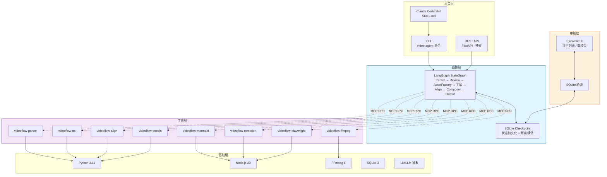

### 3.2 分层详解

#### 3.2.1 入口层

| 入口 | 目标用户 | 交互方式 | MVP 状态 |
|------|---------|---------|---------|
| CLI(`video-agent`) | 开发者 / 脚本自动化 | 命令行 | ✅ MVP |
| Claude Code Skill | Claude Code 用户 | 自然语言触发 | ✅ MVP |
| REST API | 外部系统集成 | HTTP JSON | 🟡 接口预留,不强制实现 |

#### 3.2.2 编排层 · LangGraph 状态机

**职责**:将用户请求转换为有状态的流水线执行,支持审核中断、失败重试、断点恢复。

**关键能力**:

- `StateGraph`:声明式定义节点与边
- `interrupt()`:流水线挂起等待外部事件
- `Checkpointer`(SQLite 实现):每次状态转移自动持久化
- `Tracing`:每次 Node 执行自动记录输入/输出/耗时

#### 3.2.3 工具层 · MCP Server 集群

**职责**:将每一类能力包装为独立的 MCP Server,对编排层暴露统一协议。

**设计原则**:

- 每个 Server 进程独立,崩溃不影响其他
- 每个 Server 可独立启动、测试、替换
- 协议契约稳定,便于社区贡献新 Server

#### 3.2.4 审核层 · Streamlit UI

**职责**:展示项目状态 + 接收人工审核动作。

**设计原则**:

- 与编排层解耦,只通过 SQLite 状态通信
- 不直接调用 MCP Server(所有业务逻辑在 Worker 进程)
- 单页应用,最大化"一眼看懂、一键操作"

#### 3.2.5 基础依赖层

运行时与系统级依赖,通过 Docker compose 或本地安装提供。

### 3.3 数据流向图

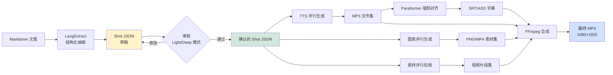

### 3.4 进程与部署拓扑

#### 3.4.1 进程组成

| 进程 | 启动方式 | 生命周期 | 职责 |
|------|---------|---------|------|
| **CLI Client** | 用户执行命令 | 短生命周期(秒级) | 创建 Project,拉起 Worker |
| **Worker** | CLI 拉起 | 长生命周期(分钟级) | 执行 LangGraph 流水线 |
| **Streamlit UI** | `streamlit run` | 常驻 | 展示项目列表 + 审核 |
| **MCP Server × 8** | 按需启动 | 长生命周期(进程池) | 提供具体工具能力 |
| **SQLite** | 内嵌(无独立进程) | — | 状态 + 队列 |

#### 3.4.2 进程间通信

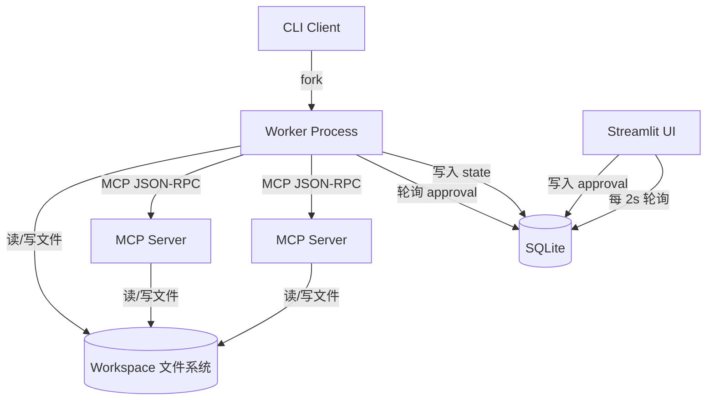

#### 3.4.3 单机部署拓扑

所有进程运行在同一台机器,通过 localhost 通信:

```
┌──────────────────────────────────────────────────┐
│ User Host Machine                                │
│                                                  │
│  ┌────────────────┐       ┌───────────────────┐  │
│  │ Terminal A     │       │ Terminal B        │  │
│  │ video-agent    │       │ streamlit run ui  │  │
│  │ generate ...   │       │ localhost:8501    │  │
│  └───────┬────────┘       └─────────┬─────────┘  │
│          │                          │            │
│          ▼                          ▼            │
│  ┌─────────────────────────────────────────────┐ │
│  │  Worker Process (LangGraph)                 │ │
│  └─┬───────────┬───────────┬───────────┬───────┘ │
│    │           │           │           │         │
│    ▼           ▼           ▼           ▼         │
│  ┌────┐    ┌──────┐    ┌───────┐   ┌────────┐   │
│  │MCP1│    │MCP2  │    │MCP...│   │MCP8    │   │
│  └────┘    └──────┘    └───────┘   └────────┘   │
│                                                  │
│  ┌──────────────────────────────────────────┐   │
│  │  SQLite (state.db) + Workspace (files)   │   │
│  └──────────────────────────────────────────┘   │
└──────────────────────────────────────────────────┘
```

#### 3.4.4 Docker compose 部署(预留)

V1 默认本地安装,Docker compose 作为推荐发布形态,所有服务一键起。

### 3.5 核心抽象的边界与契约

#### 3.5.1 LangGraph Node 契约

```python
class NodeProtocol(Protocol):
    async def __call__(self, state: VideoflowState) -> dict:
        """
        接收完整状态,返回状态增量 dict(而非全量替换)
        必须是幂等的:相同输入多次调用得相同输出
        必须捕获所有异常并通过 state.error 上报
        """
```

#### 3.5.2 MCP Tool 契约

每个 MCP Server 必须满足:

- 暴露至少一个 `tool` 方法,JSON Schema 完备
- 输入/输出全部为 JSON 可序列化
- 错误以 MCP 标准错误码返回,不抛未捕获异常
- 日志输出到 stderr,不污染 stdout
- 进程退出码:0 成功,非 0 失败

#### 3.5.3 Provider 插件契约

```python
class BaseTTSProvider(ABC):
    @abstractmethod
    async def synthesize(
        self,
        text: str,
        voice: str,
        output_path: Path
    ) -> TTSResult:
        """返回实际生成音频的时长、文件路径、采样率等"""

    @abstractmethod
    def list_voices(self) -> list[VoiceInfo]:
        """返回该 Provider 支持的所有声线"""
```

同类 Provider(TTS / LLM / Subtitle-Align / Stock)继承各自的 ABC。

#### 3.5.4 Template 契约

```
templates/
└── explainer/
    ├── template.yaml       # 元信息:名称、默认风格、目标时长范围
    ├── planner_prompt.md   # Planner LLM 的 system prompt
    ├── few_shot.json       # LangExtract few-shot 示例
    └── review_schema.py    # 该模板的审核字段定义
```

每个 Template 是一个目录,加载时系统扫描 `templates/` 下所有子目录并注册。

---

## 第四部分 · 核心数据模型

本章定义贯穿系统的核心数据结构,所有 Node / MCP Server / UI 统一使用这些模型。数据模型变更需要版本号升级并保持向后兼容。

### 4.1 Project(项目)

#### 4.1.1 字段定义

```python
class Project(BaseModel):
    project_id: str              # 全局唯一,格式 proj_{8位随机}
    created_at: datetime
    updated_at: datetime

    # 输入
    input_text: str              # 原始 Markdown
    input_path: Path | None      # 输入文件路径(如通过 CLI 传入)
    template: str                # "explainer" | "news_digest"
    review_mode: ReviewMode      # AUTO | LIGHT | DEEP
    target_duration: int = 60    # 目标时长(秒)

    # 状态
    status: ProjectStatus        # 见 4.1.2
    current_node: str | None     # 正在执行的 Node 名
    error: str | None            # 最近一次错误(如有)

    # 输出
    output_path: Path | None     # 最终 MP4 路径
    thumbnail_path: Path | None  # 封面缩略图

    # 配置快照(避免 config 变更影响在途项目)
    config_snapshot: dict
```

#### 4.1.2 状态机

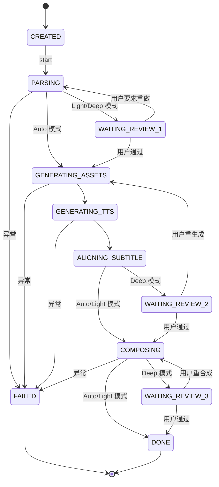

#### 4.1.3 持久化布局

```
workspace/
└── proj_a1b2c3d4/
    ├── input.md                # 原始输入
    ├── config.toml              # 配置快照
    ├── state.json               # Project 对象序列化
    ├── shots/
    │   ├── shotlist.v1.json     # Parser 产出
    │   ├── shotlist.v2.json     # 审核后版本
    │   └── shotlist.final.json  # TTS 回写后版本
    ├── assets/
    │   ├── shot_01_chart.png
    │   ├── shot_02_diagram.mp4
    │   └── ...
    ├── audio/
    │   ├── shot_01.mp3
    │   ├── shot_01.srt
    │   └── ...
    ├── preview/
    │   └── low_res.mp4          # 终片前预览
    └── final.mp4                # 最终输出
```

### 4.2 Shot(分镜)

#### 4.2.1 字段定义

```python
class Shot(BaseModel):
    shot_id: str                 # "S01", "S02", ...
    start: float                 # 开始秒数(浮点,用于精确对齐)
    end: float                   # 结束秒数
    narration: str               # 旁白文本

    # 画面规格
    visual: VisualSpec           # 多态,见 4.2.2

    # 渲染器选择
    renderer: Renderer           # MERMAID | REMOTION | PLAYWRIGHT | STATIC

    # 字幕样式
    subtitle_style: str = "default"

    # TTS 配置(None 表示继承 UserProfile 默认)
    tts_voice: str | None = None
    tts_speed: float | None = None

    # 中间产物路径(执行过程中填充)
    audio_file: Path | None = None
    visual_file: Path | None = None
    subtitle_file: Path | None = None

    # 元信息
    source_span: tuple[int, int] | None = None  # LangExtract source grounding
    notes: str | None = None     # 审核备注
```

#### 4.2.2 VisualSpec 多态结构

```python
class VisualSpec(BaseModel):
    type: VisualType             # 类型标识

class ChartVisual(VisualSpec):
    type: Literal["chart"]
    chart_type: Literal["bar", "line", "pie", "scatter"]
    data: dict                   # { "labels": [...], "values": [...] }
    title: str | None = None
    color_scheme: str = "default"

class DiagramVisual(VisualSpec):
    type: Literal["diagram"]
    mermaid_code: str            # Mermaid DSL

class TitleCardVisual(VisualSpec):
    type: Literal["title_card"]
    text: str
    background: str = "dark"
    highlight_keywords: list[str] = []

class StockFootageVisual(VisualSpec):
    type: Literal["stock_footage"]
    query: str                   # Pexels 搜索关键词
    orientation: Literal["portrait", "landscape"] = "portrait"

class ScreenCaptureVisual(VisualSpec):
    type: Literal["screen_capture"]
    url: str                     # Playwright 访问 URL
    selector: str | None = None  # 可选:只截取某元素
    interactions: list[dict] = []# 可选:滚动/点击等

class ImageVisual(VisualSpec):
    type: Literal["image"]
    path: Path                   # 本地图片路径
    ken_burns: bool = True       # 是否应用 Ken Burns 推拉效果
```

#### 4.2.3 Renderer 字段

```python
class Renderer(str, Enum):
    MERMAID = "mermaid"          # Mermaid-CLI → 静态 PNG
    REMOTION = "remotion"        # Remotion → 动态 MP4
    PLAYWRIGHT = "playwright"    # Playwright 录屏 → MP4
    STATIC = "static"            # 直接用 static 图片 + Ken Burns
```

**选择指南**:

| 画面类型 | 推荐 Renderer | 理由 |
|---------|--------------|------|
| 流程图(简单) | Mermaid | 一键出图,零配置 |
| 流程图(带动画) | Remotion | 节点依次入场 |
| 数据图表(静态) | Remotion Chart 组件 | 精准数据 + 动画入场 |
| 数据图表(动态) | Playwright + HTML | 需要复杂交互时 |
| 标题卡/金句 | Remotion | 文字动画最流畅 |
| 网页截图 | Playwright | 原生支持 |
| 库存视频 | STATIC(不渲染) | 直接使用下载的 MP4 |

#### 4.2.4 示例 Shot JSON

```json
{
  "shot_id": "S04",
  "start": 28.0,
  "end": 38.5,
  "narration": "你的钱去了哪?散户买单,进入二级市场,流进卖方口袋。",
  "visual": {
    "type": "diagram",
    "mermaid_code": "graph LR\n  A[散户买单] --> B[二级市场]\n  B --> C[卖方口袋]\n  style A fill:#ffcdd2\n  style C fill:#c8e6c9"
  },
  "renderer": "remotion",
  "subtitle_style": "highlight_keyword",
  "tts_voice": "zh-CN-YunxiNeural",
  "source_span": [342, 398]
}
```

### 4.3 ShotList(分镜集合)

```python
class ShotList(BaseModel):
    version: Literal["1"] = "1"     # Schema 版本号
    project_id: str
    template: str
    target_duration: int
    actual_duration: float | None = None  # TTS 回写后的实际总时长

    shots: list[Shot]
    audio_timeline: list[AudioTimelineEntry] | None = None

    # 全局元信息
    style_preset: str = "default"
    bgm_path: Path | None = None

class AudioTimelineEntry(BaseModel):
    shot_id: str
    audio_file: Path
    start: float
    end: float
    subtitle_file: Path
```

### 4.4 AssetBundle(素材包)

```python
class AssetBundle(BaseModel):
    project_id: str
    assets: list[Asset]

class Asset(BaseModel):
    shot_id: str                 # 归属分镜
    asset_type: AssetType        # VIDEO | IMAGE | AUDIO | SUBTITLE
    file_path: Path
    duration: float | None = None
    checksum: str                # SHA256,用于缓存键
    renderer: str | None = None  # 哪个 Renderer 产出
    metadata: dict = {}          # 额外信息(分辨率、帧率等)
```

### 4.5 UserProfile(用户偏好)

#### 4.5.1 默认字段

```yaml
# ~/.videoflow/user_profile.yaml
user:
  name: "Hui"
  locale: "zh-CN"

defaults:
  voice: "zh-CN-YunxiNeural"     # 默认 TTS 声线
  voice_speed: 1.0
  target_duration: 60
  brand_color: "#FF6B35"
  font_cjk: "Noto Sans CJK SC"
  font_latin: "Inter"

preferences:
  bgm_style: "minimal_electronic" # 占位字段,V1.5 生效
  subtitle_position: "bottom_center"
  subtitle_font_size: 56

review:
  default_mode: "light"          # auto | light | deep
```

#### 4.5.2 V1 形态与 V2 演进

| 版本 | 形态 | 交互 |
|------|------|------|
| V1 | 显式 YAML 文件,用户手写 | CLI `video-agent config edit` 快速编辑 |
| V1.5 | YAML + Skill Distiller 提议 | Agent 提议条目,用户批准才写入 |
| V2 | 完整 memory curation | 自动学习,可解释可删除 |

### 4.6 完整 Shot JSON Schema(精简参考)

```json
{
  "$schema": "http://json-schema.org/draft-07/schema#",
  "title": "Shot",
  "type": "object",
  "required": ["shot_id", "start", "end", "narration", "visual", "renderer"],
  "properties": {
    "shot_id": { "type": "string", "pattern": "^S\\d{2,}$" },
    "start": { "type": "number", "minimum": 0 },
    "end": { "type": "number", "minimum": 0 },
    "narration": { "type": "string", "minLength": 1 },
    "visual": {
      "oneOf": [
        { "$ref": "#/definitions/ChartVisual" },
        { "$ref": "#/definitions/DiagramVisual" },
        { "$ref": "#/definitions/TitleCardVisual" },
        { "$ref": "#/definitions/StockFootageVisual" },
        { "$ref": "#/definitions/ScreenCaptureVisual" },
        { "$ref": "#/definitions/ImageVisual" }
      ]
    },
    "renderer": { "enum": ["mermaid", "remotion", "playwright", "static"] },
    "subtitle_style": { "type": "string", "default": "default" },
    "tts_voice": { "type": ["string", "null"] },
    "tts_speed": { "type": ["number", "null"] }
  }
}
```

完整 Schema 见附录 D(第 12 部分)。

---

## 第五部分 · 核心业务流程

### 5.1 端到端主流程图

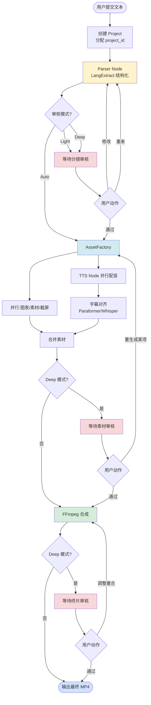

### 5.2 LangGraph 状态机设计

#### 5.2.1 节点清单

| Node | 输入 | 输出 | 可中断? | 典型耗时 |
|------|------|------|---------|---------|
| `parser_node` | input_text, template | ShotList v1 | 否 | 10-20s |
| `review1_node` | ShotList v1 | approved ShotList | **是**(interrupt) | 用户决定 |
| `asset_factory_node` | ShotList | AssetBundle(视觉部分) | 否 | 60-180s |
| `tts_node` | ShotList.shots[].narration | AudioBundle | 否 | 20-40s |
| `align_node` | AudioBundle + narration | SubtitleBundle | 否 | 10-30s |
| `review2_node`(Deep 模式) | AssetBundle + AudioBundle | approved | **是** | 用户决定 |
| `composer_node` | AssetBundle + AudioBundle + SubtitleBundle | preview.mp4 | 否 | 30-60s |
| `review3_node`(Deep 模式) | preview.mp4 | approved | **是** | 用户决定 |
| `output_node` | preview.mp4 | final.mp4 + 元数据 | 否 | 10s |

#### 5.2.2 Graph 结构(Python 伪代码)

```python
from langgraph.graph import StateGraph, START, END

graph = StateGraph(VideoflowState)

graph.add_node("parser", parser_node)
graph.add_node("review1", review1_node)      # interrupt 节点
graph.add_node("asset_factory", asset_factory_node)
graph.add_node("tts", tts_node)
graph.add_node("align", align_node)
graph.add_node("review2", review2_node)      # interrupt 节点
graph.add_node("composer", composer_node)
graph.add_node("review3", review3_node)      # interrupt 节点
graph.add_node("output", output_node)

graph.add_edge(START, "parser")
graph.add_conditional_edges(
    "parser",
    lambda s: "review1" if s.review_mode != "auto" else "asset_factory",
)
graph.add_conditional_edges(
    "review1",
    lambda s: "parser" if s.review_action == "redo" else "asset_factory",
)

# asset_factory 和 tts 并行(通过 Send API)
graph.add_edge("asset_factory", "align")
graph.add_edge("tts", "align")

graph.add_conditional_edges(
    "align",
    lambda s: "review2" if s.review_mode == "deep" else "composer",
)
graph.add_conditional_edges(
    "review2",
    lambda s: "asset_factory" if s.review_action == "regenerate" else "composer",
)
graph.add_conditional_edges(
    "composer",
    lambda s: "review3" if s.review_mode == "deep" else "output",
)
graph.add_conditional_edges(
    "review3",
    lambda s: "composer" if s.review_action == "recompose" else "output",
)
graph.add_edge("output", END)

app = graph.compile(checkpointer=SqliteSaver(conn))
```

#### 5.2.3 VideoflowState 定义

```python
class VideoflowState(TypedDict):
    project_id: str
    input_text: str
    template: str
    review_mode: Literal["auto", "light", "deep"]
    target_duration: int

    # 中间产物
    shotlist: ShotList | None
    asset_bundle: AssetBundle | None
    audio_bundle: AudioBundle | None
    subtitle_bundle: SubtitleBundle | None
    preview_path: Path | None

    # 审核交互
    review_action: Literal["approve", "modify", "redo", "regenerate", "recompose"] | None
    review_feedback: str | None       # 用户自然语言反馈(可选)
    review_edits: dict | None          # 用户手动编辑(可选)

    # 错误
    error: str | None
    retry_count: int
```

#### 5.2.4 Checkpoint 存储

SQLite 表结构:

```sql
CREATE TABLE checkpoints (
    thread_id TEXT,
    checkpoint_ns TEXT,
    checkpoint_id TEXT,
    parent_checkpoint_id TEXT,
    type TEXT,
    checkpoint BLOB,
    metadata BLOB,
    PRIMARY KEY (thread_id, checkpoint_ns, checkpoint_id)
);

CREATE TABLE writes (
    thread_id TEXT,
    checkpoint_ns TEXT,
    checkpoint_id TEXT,
    task_id TEXT,
    idx INTEGER,
    channel TEXT,
    value BLOB,
    PRIMARY KEY (thread_id, checkpoint_ns, checkpoint_id, task_id, idx)
);
```

`thread_id` 直接使用 `project_id`,一个项目的所有状态快照在一个 thread 里。

### 5.3 三档审核模式详细规范

#### 5.3.1 模式对比表

| 维度 | Auto | Light(默认) | Deep |
|------|------|-------------|------|
| 审核点数量 | 0 | 1(分镜) | 3(分镜+素材+终片) |
| 用户操作步骤 | 0 | 1-3 | 3-10 |
| 典型全流程耗时(含用户) | 10-15 min | 12-18 min | 30-60 min |
| 异常阻塞时 | 自动 fallback,失败则停止 | 进入审核等待 | 进入审核等待 |
| 适用场景 | 批量生产、CI | 日常内容创作 | 精品内容、调试模板 |

#### 5.3.2 Light 模式审核界面(主力场景)

```
┌────────────────────────────────────────────────────────┐
│  Videoflow · 项目 proj_a1b2c3d4                         │
│  ────────────────────────────────────────────────────  │
│                                                        │
│  📋 分镜稿生成完成                                     │
│                                                        │
│  ┌──────────────────────────────────────────────────┐ │
│  │ 模板:explainer  │  6 个分镜  │  预计 62 秒       │ │
│  └──────────────────────────────────────────────────┘ │
│                                                        │
│  分镜摘要                                              │
│  ────────────────                                      │
│  [S01] 0-8s    标题卡:公司赚的钱跟你没关系            │
│  [S02] 8-22s   流程图:资金流向(散户→市场→卖方)       │
│  [S03] 22-35s  柱状图:A股/港股/美股分红率对比         │
│  [S04] 35-48s  金字塔图:接力信念结构                  │
│  [S05] 48-58s  辐射图:四方信念维护者                  │
│  [S06] 58-62s  结尾卡:思考题                          │
│                                                        │
│  [ ✅ 通过 ]    [ ✏️ 修改 ]    [ 🔄 重新生成 ]        │
│                                                        │
│  ▼ 查看完整分镜 JSON(可选,展开后可编辑)              │
└────────────────────────────────────────────────────────┘
```

**三按钮语义**:

| 按钮 | 语义 | 触发动作 |
|------|------|---------|
| ✅ 通过 | 分镜稿接受,启动后续全自动流程 | `review_action = "approve"` |
| ✏️ 修改 | 展开 JSON 编辑器/自然语言反馈框 | 进入子页面,提交后按反馈重跑 Parser |
| 🔄 重新生成 | 当前分镜稿不满意,重新跑 Parser(可能换种子) | `review_action = "redo"` |

#### 5.3.3 Deep 模式三个审核点

| 审核点 | 展示内容 | 可执行动作 |
|-------|---------|-----------|
| **Review 1:分镜稿** | 完整 ShotList JSON + 分镜表 + 原文对照 | 通过 / 编辑 JSON / 自然语言反馈重做 |
| **Review 2:素材与音频** | 每个 Shot 的:视觉缩略图 + 音频播放 + SRT 预览 | 批量通过 / 重生成单个 Shot 的素材/音频 |
| **Review 3:终片** | 预览 MP4(低码率) + 基础检查报告(时长/同步性) | 通过(导出高清)/ 调整后重合成 |

#### 5.3.4 模式切换方式

```bash
# CLI 优先级最高
video-agent generate draft.md --review auto
video-agent generate draft.md --review light
video-agent generate draft.md --review deep

# 配置文件默认
# ~/.videoflow/config.toml
# [review]
# default_mode = "light"

# 运行时在 UI 切换(未来版本)
```

### 5.4 核心时序图

#### 5.4.1 CLI 提交任务 → 审核 → 恢复

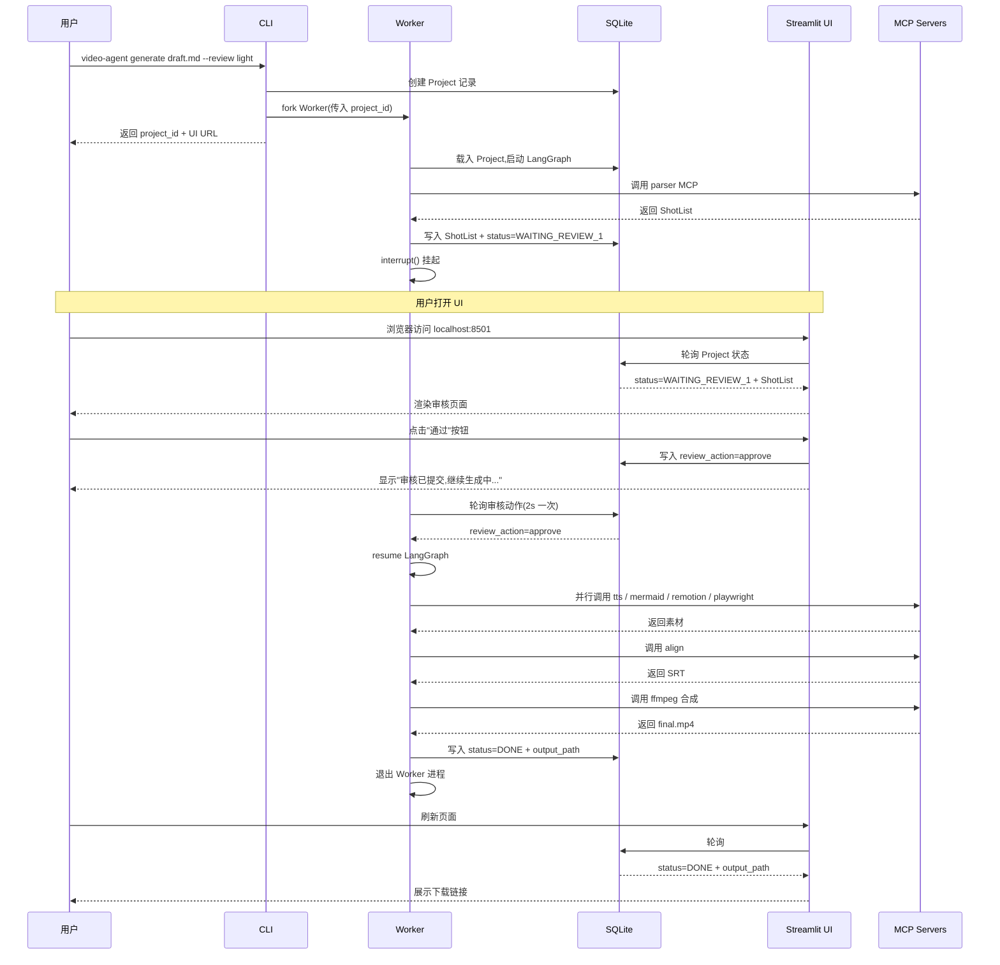

#### 5.4.2 Parser Node 调用 LangExtract 时序

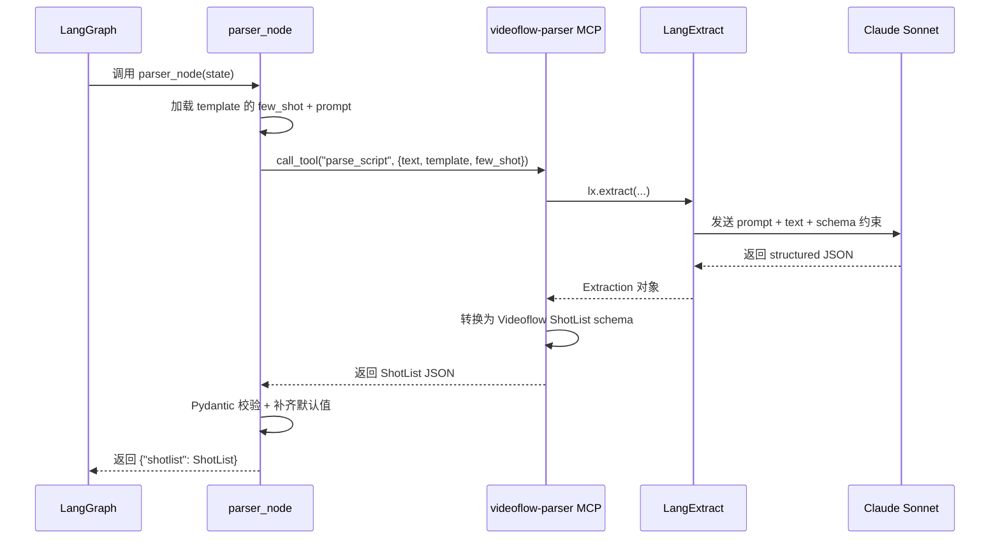

#### 5.4.3 AssetFactory 并行调用时序

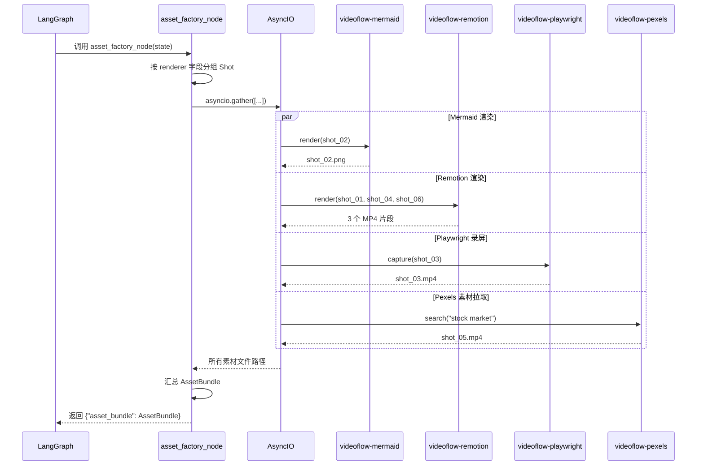

### 5.5 异步阻断式审核机制

#### 5.5.1 核心挑战

LangGraph 的 `interrupt()` 会阻塞当前节点执行,但 **Streamlit 是同步 Web 应用**,不能作为 LangGraph 的恢复触发源。解决方案:**基于 SQLite 状态的双向轮询**。

#### 5.5.2 Worker 生命周期

```python
# worker.py 简化示意
def run_worker(project_id: str):
    state = load_project(project_id)
    checkpointer = SqliteSaver.from_conn_string("state.db")
    graph = build_graph(checkpointer)

    config = {"configurable": {"thread_id": project_id}}

    # 首次运行或从 interrupt 恢复
    while True:
        try:
            for event in graph.stream(state, config):
                log_event(event)

            # 图执行完毕
            update_project_status(project_id, "DONE")
            break

        except GraphInterrupt as gi:
            # 写入 WAITING_REVIEW_X 状态
            update_project_status(project_id, gi.interrupt_node)

            # 轮询审核动作
            while True:
                action = poll_review_action(project_id)
                if action is not None:
                    state["review_action"] = action
                    break
                time.sleep(2)
            # 继续下一轮 stream(从 checkpoint 恢复)

        except Exception as e:
            update_project_error(project_id, str(e))
            break
```

#### 5.5.3 Streamlit 轮询

```python
# streamlit_ui.py 简化示意
import streamlit as st

project_id = st.query_params.get("project")
project = load_project(project_id)

# 每 2 秒自动刷新
st_autorefresh(interval=2000)

if project.status == "WAITING_REVIEW_1":
    render_shot_review(project.shotlist)
    if st.button("通过"):
        write_review_action(project_id, "approve")
        st.success("已提交,Worker 将继续...")

elif project.status == "DONE":
    st.video(project.output_path)
    st.download_button("下载 MP4", ...)

elif project.status.startswith("GENERATING"):
    st.info(f"生成中:{project.current_node}")
    st.progress(estimate_progress(project))
```

#### 5.5.4 轮询间隔与延迟

| 场景 | 轮询间隔 | 期望延迟 |
|------|---------|---------|
| Streamlit 读 Project 状态 | 2s | ≤2s |
| Worker 读 review_action | 2s | ≤2s |
| 用户感知延迟(从点击到 Worker 继续) | — | 2-4s |

对单用户场景这是可接受的工程权衡。若未来需要更低延迟,可引入 FastAPI WebSocket 推送。

### 5.6 失败与重试策略

#### 5.6.1 Shot 级重试

每个 MCP Server 调用包装在 `with_retry(max_attempts=3, backoff=exponential)` 中。单个 Shot 失败不影响其他 Shot 的并行处理。

#### 5.6.2 Provider 级 fallback

```python
# 配置层定义 fallback 链
[providers.tts]
primary = "edge-tts"
fallback = ["azure-tts"]

# 运行时:edge-tts 超时或返回错误 → 自动切 azure-tts(如已配置 API key)
# 如果 fallback 也失败 → 整个 TTS Node 失败,进入 FAILED 状态
```

#### 5.6.3 全局失败上报

| 错误位置 | 处理方式 | 用户可见 |
|---------|---------|---------|
| Node 内部异常 | 捕获,写入 `state.error`,Project 进入 FAILED | 状态页显示错误摘要 |
| MCP Server 崩溃 | 重启进程,最多 3 次,失败则标记该 MCP 不可用 | 日志中详细栈 |
| FFmpeg 合成失败 | 保留已生成素材,Project 进入 FAILED | 用户可选"换参数重合成"(V1.5) |
| 磁盘满 | 立即停止,不清理已有文件,写 FAILED | 强提示用户清理 workspace |

所有失败都写入 `workspace/{project_id}/error.log`,便于事后排查。

---

> **第一部分完**(第 0-5 章)。
>
> 下一部分将输出:第六~八部分(模块详细设计、工程细节、测试),保持上下文连贯。请审阅本部分后反馈。

## 第六部分 · 模块详细设计

### 6.1 入口层

Videoflow 提供三套入口,分别服务于不同使用场景。三者**底层共享同一套 Worker 逻辑**,只是触发方式不同。

#### 6.1.1 入口对比

| 入口 | 命令/方式 | 目标用户 | 典型场景 |
|------|----------|---------|---------|
| CLI | `video-agent ...` | 开发者、脚本自动化 | 本地开发、批量生产 |
| Claude Code Skill | 自然语言触发 | Claude Code 用户 | 快速"一句话出视频" |
| REST API(预留) | HTTP JSON | 外部系统集成 | 远程触发、CI/CD |

#### 6.1.2 CLI 设计

**总览**:

```
video-agent <subcommand> [options]
```

**子命令清单**:

| 子命令 | 用途 | 典型用法 |
|-------|------|---------|
| `generate` | 提交新的生成任务 | `video-agent generate draft.md --review light` |
| `status` | 查看项目状态 | `video-agent status proj_a1b2c3d4` |
| `list` | 列出所有项目 | `video-agent list --status running` |
| `resume` | 恢复中断的项目 | `video-agent resume proj_a1b2c3d4` |
| `render` | 仅重新合成(跳过前置步骤) | `video-agent render proj_a1b2c3d4` |
| `cancel` | 取消运行中的项目 | `video-agent cancel proj_a1b2c3d4` |
| `config` | 管理配置 | `video-agent config edit` |
| `doctor` | 诊断环境 | `video-agent doctor` |
| `ui` | 启动审核 UI | `video-agent ui`(等价 `streamlit run ...`) |

**`generate` 子命令参数**:

```
video-agent generate <input> [options]

参数:
  <input>                    输入文件(.md / .txt)或 "-"(从 stdin 读取)

选项:
  --template TEMPLATE        模板名 [默认: explainer]
                             可选: explainer | news_digest | <自定义>
  --review MODE              审核模式 [默认: light]
                             可选: auto | light | deep
  --duration SECONDS         目标时长(秒)[默认: 60]
  --voice VOICE              TTS 声线 [默认: 用户 profile 配置]
  --style STYLE              视觉风格预设 [默认: default]
  --output PATH              输出路径 [默认: workspace/{project_id}/final.mp4]
  --project-id ID            指定项目 ID(默认自动生成)
  --no-ui                    不提示打开 UI
  --verbose                  详细日志
```

**示例**:

```bash
# 最简用法
video-agent generate my_draft.md

# 批量生产(Auto 模式)
ls drafts/*.md | xargs -I{} video-agent generate {} --review auto

# 从管道输入
cat article.txt | video-agent generate - --template news_digest

# 深度审核模式
video-agent generate draft.md --review deep --duration 90
```

**输出示例**:

```
$ video-agent generate my_draft.md --review light
✓ Project created: proj_7f3a2b1c
  Input:         my_draft.md (1,247 chars)
  Template:      explainer
  Review mode:   light
  Duration:      60s (target)

✓ Worker started (PID 28456)
  Log:           workspace/proj_7f3a2b1c/worker.log
  UI:            http://localhost:8501/?project=proj_7f3a2b1c

ℹ Parsing script... (~20s)
```

#### 6.1.3 Claude Code Skill 设计

**SKILL.md** 放在项目根目录,Claude Code 会自动发现并可加载。

```markdown
---
name: videoflow
description: Turn text drafts into short videos (Douyin/TikTok/YouTube Shorts).
  Use when the user wants to convert a markdown article, knowledge summary,
  or news excerpt into a 60-second vertical video with charts, diagrams,
  narration, and subtitles. Invoked by phrases like "make a video from this",
  "turn this into a short", or specific platform mentions like "make a Douyin video".
---

# Videoflow Skill

When the user asks to turn text content into a short video, use Videoflow.

## Usage

1. Save the user's text to a temporary file in their workspace
2. Run: `video-agent generate <file> --review light`
3. Parse the output for the `project_id` and UI URL
4. Tell the user to open the UI URL for the 1-click review
5. Optionally poll `video-agent status <project_id>` to report progress

## Important

- Default review mode is `light` (one review point). Only use `auto` if the
  user explicitly asks for full automation.
- The user must have Streamlit UI running (`video-agent ui` in another terminal).
- If `video-agent doctor` reports missing dependencies, help the user install
  them before proceeding.

## Templates available
- `explainer`: Default for knowledge/science content
- `news_digest`: For news summaries

Let the user pick or auto-select based on content type.
```

#### 6.1.4 REST API 设计(预留,MVP 不强制实现)

**核心接口**:

```
POST   /api/v1/projects              # 创建项目
GET    /api/v1/projects              # 列出项目
GET    /api/v1/projects/{id}         # 获取项目详情
POST   /api/v1/projects/{id}/review  # 提交审核动作
DELETE /api/v1/projects/{id}         # 取消项目
GET    /api/v1/projects/{id}/output  # 下载最终 MP4
```

**请求示例**:

```http
POST /api/v1/projects
Content-Type: application/json

{
  "input_text": "...",
  "template": "explainer",
  "review_mode": "light",
  "target_duration": 60
}
```

**响应示例**:

```json
{
  "project_id": "proj_7f3a2b1c",
  "status": "CREATED",
  "created_at": "2026-04-19T09:30:00Z",
  "ui_url": "http://localhost:8501/?project=proj_7f3a2b1c"
}
```

### 6.2 编排层 · LangGraph Agent

#### 6.2.1 Agent 组织结构

Videoflow 是**单一 Graph + 多 Node**,不是多 Agent 架构。选择理由:

| 方案 | 适合场景 | 为何不选 |
|------|---------|---------|
| 多 Agent + Handoffs | 对话分诊、多角色协作 | Videoflow 是线性流水线,无角色切换 |
| 多 Agent + Supervisor | 任务分解动态路由 | Videoflow 流程基本确定,无需动态决策 |
| **单 Graph + 多 Node** | **线性流水线 + 条件分支** | ✅ 匹配 |

所有 Node 共享 `VideoflowState`,Node 之间通过 state 字段传递数据,不需要 agent-to-agent 协议。

#### 6.2.2 完整 Node 实现规范

每个 Node 都遵循统一模板:

```python
# src/videoflow/agent/nodes/base.py
from abc import ABC, abstractmethod
from typing import TypedDict

class BaseNode(ABC):
    """所有 Node 的基类。"""

    name: str                    # Node 名(用于日志/trace)
    timeout: int = 300           # 单次执行超时秒数
    retry_attempts: int = 3      # 失败重试次数

    @abstractmethod
    async def __call__(self, state: VideoflowState) -> dict:
        """
        执行 Node 逻辑。
        - 返回 state 增量 dict(LangGraph 会 merge)
        - 异常应在内部处理或抛出 NodeFailedError
        - 必须幂等:相同 state 多次调用得相同结果
        """
        pass

    def on_enter(self, state: VideoflowState) -> None:
        """Node 进入时的钩子(日志、状态更新)"""
        update_project_status(
            state["project_id"],
            current_node=self.name,
        )
        log.info(f"Enter node: {self.name}")

    def on_exit(self, state: VideoflowState, result: dict) -> None:
        """Node 退出时的钩子"""
        log.info(f"Exit node: {self.name}")
```

#### 6.2.3 关键 Node 实现要点

**parser_node**:

```python
class ParserNode(BaseNode):
    name = "parser"
    timeout = 120

    async def __call__(self, state: VideoflowState) -> dict:
        self.on_enter(state)

        # 1. 加载模板
        template = load_template(state["template"])

        # 2. 通过 MCP 调用 LangExtract
        client = get_mcp_client("videoflow-parser")
        result = await client.call_tool(
            "parse_script",
            {
                "text": state["input_text"],
                "template": state["template"],
                "few_shot": template.few_shot,
                "target_duration": state["target_duration"],
            },
        )

        # 3. Pydantic 校验
        shotlist = ShotList.model_validate(result["shotlist"])

        # 4. 补齐默认值(user_profile)
        shotlist = apply_user_profile_defaults(shotlist)

        self.on_exit(state, {"shotlist": shotlist})
        return {"shotlist": shotlist}
```

**review1_node**(中断节点的关键实现):

```python
from langgraph.errors import NodeInterrupt

class Review1Node(BaseNode):
    name = "review1"

    async def __call__(self, state: VideoflowState) -> dict:
        # 写入状态,等待外部响应
        update_project_status(state["project_id"], "WAITING_REVIEW_1")

        # 利用 LangGraph 的 interrupt 能力
        # 这里不实际阻塞 — Worker 轮询层会捕获状态
        # 并等待 review_action 写入 SQLite
        raise NodeInterrupt("Waiting for user review on shotlist")
```

配合 Worker 的轮询循环(已在第 1 卷 §5.5.2 描述),这一 Node 实际作用是"**打开审核口子并让 Graph 暂停**"。

**asset_factory_node**(并行执行):

```python
class AssetFactoryNode(BaseNode):
    name = "asset_factory"
    timeout = 600

    async def __call__(self, state: VideoflowState) -> dict:
        self.on_enter(state)
        shotlist = state["shotlist"]

        # 按 renderer 分组
        by_renderer: dict[Renderer, list[Shot]] = {}
        for shot in shotlist.shots:
            by_renderer.setdefault(shot.renderer, []).append(shot)

        # 并行执行各类渲染
        tasks = []
        for renderer, shots in by_renderer.items():
            mcp_name = RENDERER_MCP_MAP[renderer]
            client = get_mcp_client(mcp_name)
            for shot in shots:
                tasks.append(
                    render_shot_with_retry(client, shot, shotlist.project_id)
                )

        assets = await asyncio.gather(*tasks, return_exceptions=True)

        # 处理部分失败
        successful, failed = split_results(assets)
        if failed and len(failed) > len(shotlist.shots) * 0.3:
            raise NodeFailedError(f"Too many failures: {len(failed)}")

        bundle = AssetBundle(
            project_id=shotlist.project_id,
            assets=successful,
        )
        return {"asset_bundle": bundle}
```

#### 6.2.4 Tracing 与可观测性

每次 Node 执行自动记录:

```
workspace/{project_id}/traces/
├── 2026-04-19T09-30-00_parser.json
├── 2026-04-19T09-30-15_review1.json
├── 2026-04-19T09-35-02_asset_factory.json
└── ...
```

每条 trace 内容:

```json
{
  "node": "parser",
  "started_at": "2026-04-19T09:30:00.123Z",
  "ended_at": "2026-04-19T09:30:14.567Z",
  "duration_ms": 14444,
  "input_state_keys": ["input_text", "template", "target_duration"],
  "output_keys": ["shotlist"],
  "mcp_calls": [
    {
      "server": "videoflow-parser",
      "tool": "parse_script",
      "input_size_bytes": 1247,
      "output_size_bytes": 3521,
      "duration_ms": 14200
    }
  ],
  "llm_calls": [
    {
      "provider": "claude",
      "model": "claude-sonnet-4-7",
      "input_tokens": 1850,
      "output_tokens": 1204,
      "cost_usd": 0.021
    }
  ],
  "status": "success",
  "error": null
}
```

Streamlit UI 可以直接读 trace 文件展示执行细节(Deep 模式审核页)。

### 6.3 工具层 · MCP Server 清单

Videoflow V1 包含 **8 个 MCP Server**,每个独立进程,统一通过 MCP JSON-RPC 协议与编排层通信。

#### 6.3.1 Server 总览

| # | Server 名 | 语言 | 核心依赖 | 主要工具 | 替代方案 |
|---|----------|------|---------|---------|---------|
| 1 | `videoflow-parser` | Python | LangExtract | `parse_script` | 原生 LLM+Pydantic |
| 2 | `videoflow-mermaid` | Node | @mermaid-js/mermaid-cli | `render_diagram` | Graphviz、PlantUML |
| 3 | `videoflow-remotion` | Node | Remotion | `render_composition` | — |
| 4 | `videoflow-playwright` | Node | Playwright | `capture_animation` | Puppeteer |
| 5 | `videoflow-tts` | Python | edge-tts / azure-tts SDK | `synthesize` | ElevenLabs |
| 6 | `videoflow-align` | Python | FunASR / faster-whisper | `align_subtitle` | 原生 whisper |
| 7 | `videoflow-pexels` | Python | requests | `search`, `download` | Pixabay |
| 8 | `videoflow-ffmpeg` | Python | FFmpeg(subprocess) | `compose_scene`, `concat`, `burn_subtitle` | MoviePy |

#### 6.3.2 通用接口契约

所有 MCP Server 必须满足:

```python
# 输入
{
  "jsonrpc": "2.0",
  "method": "tools/call",
  "params": {
    "name": "<tool_name>",
    "arguments": { ... }
  },
  "id": 1
}

# 输出(成功)
{
  "jsonrpc": "2.0",
  "result": {
    "content": [
      { "type": "text", "text": "<JSON result>" }
    ]
  },
  "id": 1
}

# 输出(失败)
{
  "jsonrpc": "2.0",
  "error": {
    "code": -32000,
    "message": "<human readable>",
    "data": { "details": "..." }
  },
  "id": 1
}
```

#### 6.3.3 Server 详细定义

##### Server 1: `videoflow-parser`

**职责**:文案 → ShotList JSON。封装 LangExtract。

**工具**:

```yaml
name: parse_script
description: Convert unstructured markdown/text into a structured ShotList JSON.
input_schema:
  type: object
  required: [text, template, target_duration]
  properties:
    text:
      type: string
      description: The input markdown or plain text
    template:
      type: string
      enum: [explainer, news_digest]
    target_duration:
      type: integer
      description: Target video duration in seconds
    few_shot:
      type: array
      description: Optional few-shot examples from template
output_schema:
  type: object
  properties:
    shotlist:
      $ref: "#/definitions/ShotList"
    metadata:
      type: object
      properties:
        total_tokens: { type: integer }
        cost_usd: { type: number }
```

**依赖**:`langextract`, `litellm`
**失败策略**:首次失败 → 降级到 JSON mode 不强制 schema → 仍失败返回错误

##### Server 2: `videoflow-mermaid`

**职责**:Mermaid DSL → 静态 PNG。

**工具**:

```yaml
name: render_diagram
input_schema:
  type: object
  required: [mermaid_code, output_path]
  properties:
    mermaid_code: { type: string }
    output_path: { type: string }
    width: { type: integer, default: 1080 }
    height: { type: integer, default: 1920 }
    theme: { type: string, enum: [default, dark, forest], default: dark }
    background: { type: string, default: "#1a1a1a" }
    font_family: { type: string, default: "Noto Sans CJK SC" }
output_schema:
  type: object
  properties:
    output_path: { type: string }
    width: { type: integer }
    height: { type: integer }
```

**实现要点**:

```js
// mcp_servers/mermaid_server/index.js
import mermaid from '@mermaid-js/mermaid-cli';

async function renderDiagram(args) {
  await mermaid.run(
    args.mermaid_code,
    args.output_path,
    {
      outputFormat: 'png',
      viewport: { width: args.width, height: args.height },
      backgroundColor: args.background,
      mermaidConfig: {
        theme: args.theme,
        themeVariables: {
          fontFamily: args.font_family,
          fontSize: '32px',
        }
      }
    }
  );
  return { output_path: args.output_path, width: args.width, height: args.height };
}
```

##### Server 3: `videoflow-remotion`

**职责**:调用 Remotion 渲染动态视觉组件。

**工具**:

```yaml
name: render_composition
input_schema:
  type: object
  required: [composition_id, props, output_path, duration_seconds]
  properties:
    composition_id: { type: string }  # "Chart" | "Diagram" | "TitleCard"
    props: { type: object }            # 传给 Remotion 组件的 props
    output_path: { type: string }
    duration_seconds: { type: number }
    fps: { type: integer, default: 30 }
    width: { type: integer, default: 1080 }
    height: { type: integer, default: 1920 }
output_schema:
  type: object
  properties:
    output_path: { type: string }
    actual_duration: { type: number }
    frame_count: { type: integer }
```

**目录约定**:

```
remotion/
├── package.json
├── src/
│   ├── Root.tsx              # 注册所有 Composition
│   └── compositions/
│       ├── Chart/
│       │   ├── index.tsx
│       │   ├── BarChart.tsx
│       │   └── types.ts
│       ├── Diagram/
│       │   └── index.tsx     # 封装 Mermaid 动画入场
│       └── TitleCard/
│           └── index.tsx
```

**调用方式**:MCP Server 通过 `child_process.exec` 调用:

```bash
npx remotion render \
  src/Root.tsx \
  <composition_id> \
  <output_path> \
  --props='<JSON>' \
  --log=error
```

##### Server 4: `videoflow-playwright`

**职责**:通过 Playwright 打开 HTML 页面,录制动画为 MP4。用于 Remotion 不方便实现的复杂交互动画。

**工具**:

```yaml
name: capture_animation
input_schema:
  type: object
  required: [url_or_html, output_path, duration_seconds]
  properties:
    url_or_html: { type: string, description: "URL or inline HTML" }
    output_path: { type: string }
    duration_seconds: { type: number }
    width: { type: integer, default: 1080 }
    height: { type: integer, default: 1920 }
    interactions: { type: array }  # [{action: "scroll", at: 2.0, ...}]
output_schema:
  type: object
  properties:
    output_path: { type: string }
```

**实现要点**:使用 Playwright 的 `page.video()` + `recordVideo` 选项。

##### Server 5: `videoflow-tts`

**职责**:文本 → MP3。支持多 Provider(edge-tts 默认,Azure 可选)。

**工具**:

```yaml
name: synthesize
input_schema:
  type: object
  required: [text, voice, output_path]
  properties:
    text: { type: string }
    voice: { type: string }   # "zh-CN-YunxiNeural", "en-US-GuyNeural", ...
    output_path: { type: string }
    speed: { type: number, default: 1.0 }
    pitch: { type: number, default: 0.0 }
    provider: { type: string, enum: [edge, azure, elevenlabs], default: edge }
output_schema:
  type: object
  properties:
    output_path: { type: string }
    duration: { type: number }          # 实际音频时长(秒)
    sample_rate: { type: integer }
    provider_used: { type: string }     # 实际使用的 provider(fallback 后可能不同)
```

**Provider Fallback 实现**:

```python
async def synthesize(args):
    providers = load_tts_provider_chain()  # [primary, fallback1, ...]
    for provider in providers:
        try:
            return await provider.synthesize(**args)
        except Exception as e:
            log.warning(f"Provider {provider.name} failed: {e}, trying fallback")
    raise AllProvidersFailed()
```

##### Server 6: `videoflow-align`

**职责**:音频 + 文本 → SRT/ASS 字幕(带精确时间戳)。

**工具**:

```yaml
name: align_subtitle
input_schema:
  type: object
  required: [audio_path, reference_text, output_path]
  properties:
    audio_path: { type: string }
    reference_text: { type: string }
    output_path: { type: string }
    format: { type: string, enum: [srt, ass, vtt], default: srt }
    provider: { type: string, enum: [paraformer, whisper], default: paraformer }
    granularity: { type: string, enum: [sentence, word], default: word }
output_schema:
  type: object
  properties:
    output_path: { type: string }
    word_count: { type: integer }
    duration: { type: number }
```

**配置开关示例**(§6.4 会详细展开):

```toml
# config.toml
[providers.subtitle_align]
default = "paraformer"

[providers.subtitle_align.paraformer]
model = "paraformer-large-zh"
device = "cpu"              # or "cuda"

[providers.subtitle_align.whisper]
model = "large-v3"
language = "zh"
device = "cpu"
```

##### Server 7: `videoflow-pexels`

**职责**:关键词搜索 + 下载 Pexels 视频素材。

**工具**:

```yaml
name: search
input_schema:
  type: object
  required: [query]
  properties:
    query: { type: string }
    orientation: { type: string, enum: [portrait, landscape, square], default: portrait }
    min_duration: { type: number, default: 3 }
    per_page: { type: integer, default: 5 }
output_schema:
  type: object
  properties:
    videos:
      type: array
      items:
        type: object
        properties:
          id: { type: integer }
          url: { type: string }
          duration: { type: number }
          thumbnail: { type: string }

name: download
input_schema:
  type: object
  required: [video_id, output_path]
  properties:
    video_id: { type: integer }
    output_path: { type: string }
    quality: { type: string, enum: [sd, hd, uhd], default: hd }
```

##### Server 8: `videoflow-ffmpeg`

**职责**:最终合成。接受 Shot 清单 + 素材 + 音频,产出 MP4。

这是**整个系统的终点**,也是最关键的 Server。详细命令设计见 §6.7。

**工具**:

```yaml
name: compose_scene
description: Compose a single scene (one shot's background + audio + subtitle).
input_schema:
  type: object
  required: [visual_file, audio_file, subtitle_file, output_path, duration]
  properties:
    visual_file: { type: string }      # PNG 或 MP4
    audio_file: { type: string }       # MP3
    subtitle_file: { type: string }    # SRT/ASS
    output_path: { type: string }
    duration: { type: number }
    transition_in: { type: string, enum: [none, fade, slide], default: none }
    transition_duration: { type: number, default: 0.3 }

name: concat
description: Concatenate multiple scene files into one.
input_schema:
  type: object
  required: [scene_files, output_path]
  properties:
    scene_files: { type: array, items: { type: string } }
    output_path: { type: string }
    use_xfade: { type: boolean, default: true }
    xfade_duration: { type: number, default: 0.5 }

name: finalize
description: Add BGM, watermark, intro/outro; output final MP4.
input_schema:
  type: object
  required: [input_path, output_path]
  properties:
    input_path: { type: string }
    output_path: { type: string }
    bgm_path: { type: string, nullable: true }
    bgm_volume: { type: number, default: 0.15 }
    intro_path: { type: string, nullable: true }
    outro_path: { type: string, nullable: true }
    crf: { type: integer, default: 23 }
    preset: { type: string, default: "medium" }
```

### 6.4 Provider 插件体系

Provider 是 Videoflow **可扩展性的第一公民**。同一能力允许多个实现,用户通过配置切换,社区通过 PR 贡献新 Provider。

#### 6.4.1 Provider 分类

V1 定义 **4 类 Provider**,未来可增:

```
providers/
├── llm/
│   ├── claude.py        # 默认
│   ├── deepseek.py
│   ├── gemini.py
│   └── ollama.py
├── tts/
│   ├── edge.py          # 默认
│   ├── azure.py
│   └── elevenlabs.py
├── subtitle_align/
│   ├── paraformer.py    # 默认(中文)
│   └── whisper.py       # 备选(多语)
└── stock/
    ├── pexels.py        # 默认
    └── pixabay.py
```

#### 6.4.2 Provider 契约

每类 Provider 继承共同 ABC:

```python
# src/videoflow/providers/base.py

class BaseTTSProvider(ABC):
    name: str                # 唯一标识,如 "edge", "azure"

    @abstractmethod
    async def synthesize(
        self,
        text: str,
        voice: str,
        output_path: Path,
        speed: float = 1.0,
        pitch: float = 0.0,
    ) -> TTSResult:
        pass

    @abstractmethod
    def list_voices(self, locale: str | None = None) -> list[VoiceInfo]:
        pass

    @abstractmethod
    def health_check(self) -> bool:
        """返回 Provider 是否可用(API Key 有效、网络通等)"""
        pass


class BaseLLMProvider(ABC):
    name: str

    @abstractmethod
    async def complete(
        self,
        messages: list[dict],
        response_format: Literal["text", "json"] = "text",
        **kwargs,
    ) -> LLMResponse:
        pass


class BaseSubtitleAlignProvider(ABC):
    name: str
    supported_languages: list[str]

    @abstractmethod
    async def align(
        self,
        audio_path: Path,
        reference_text: str,
        output_path: Path,
        format: Literal["srt", "ass", "vtt"] = "srt",
        granularity: Literal["sentence", "word"] = "word",
    ) -> AlignResult:
        pass


class BaseStockProvider(ABC):
    name: str

    @abstractmethod
    async def search(
        self, query: str, orientation: str = "portrait", per_page: int = 5
    ) -> list[StockVideo]:
        pass

    @abstractmethod
    async def download(self, video_id: str, output_path: Path) -> Path:
        pass
```

#### 6.4.3 Provider 注册机制

**发现**:通过 Python entry points 自动注册,支持外部包。

```python
# pyproject.toml
[project.entry-points."videoflow.tts_providers"]
edge = "videoflow.providers.tts.edge:EdgeTTSProvider"
azure = "videoflow.providers.tts.azure:AzureTTSProvider"

# 外部包可以贡献:
# pyproject.toml (third-party package)
[project.entry-points."videoflow.tts_providers"]
my_custom = "my_package.providers:MyCustomTTS"
```

**启动时加载**:

```python
from importlib.metadata import entry_points

def load_tts_providers() -> dict[str, BaseTTSProvider]:
    providers = {}
    for ep in entry_points(group="videoflow.tts_providers"):
        cls = ep.load()
        providers[ep.name] = cls()
    return providers
```

#### 6.4.4 字幕对齐 Provider 配置开关(示例)

```toml
# ~/.videoflow/config.toml
[providers.subtitle_align]
default = "paraformer"              # 选项: paraformer | whisper
fallback = ["whisper"]               # 失败时自动切换

[providers.subtitle_align.paraformer]
model_size = "large"                # tiny | small | base | large
device = "cpu"                      # cpu | cuda
cache_dir = "~/.videoflow/models/paraformer"

[providers.subtitle_align.whisper]
model_size = "large-v3"
language = "zh"                     # 强制语言(提高精度)
device = "cpu"
compute_type = "int8"               # 量化减少内存
```

**运行时选择**:

```python
# src/videoflow/providers/subtitle_align/registry.py
def get_align_provider(config: dict) -> BaseSubtitleAlignProvider:
    providers = load_subtitle_align_providers()
    primary_name = config["default"]
    primary = providers[primary_name]
    return ProviderChain(primary, fallbacks=[
        providers[name] for name in config.get("fallback", [])
    ])
```

#### 6.4.5 新增 Provider 开发步骤

新增一个 TTS Provider(以 MiniMax TTS 为例):

1. **创建文件** `src/videoflow/providers/tts/minimax.py`
2. **实现接口**:
   ```python
   class MiniMaxTTSProvider(BaseTTSProvider):
       name = "minimax"

       def __init__(self, config: dict):
           self.api_key = config["api_key"]

       async def synthesize(self, text, voice, output_path, **kwargs):
           # 调用 MiniMax API
           ...
           return TTSResult(duration=..., ...)

       def list_voices(self, locale=None):
           return [...]

       def health_check(self):
           try:
               self._call_api("/health")
               return True
           except:
               return False
   ```
3. **注册**:在 `pyproject.toml` 添加 entry point
4. **测试**:在 `tests/providers/test_minimax_tts.py` 加 mock 测试
5. **文档**:在 `docs/providers-guide.md` 添加用法说明
6. **配置示例**:
   ```toml
   [providers.tts.minimax]
   api_key = "${MINIMAX_API_KEY}"  # 支持环境变量引用
   ```

### 6.5 Template 模板系统

#### 6.5.1 Template 的定位

Template 是**内容类型的人格化**。同样一段文本,用 `explainer` 做出来强调论证与反常识,用 `news_digest` 做出来强调事实与对比。

每个 Template 包含:

- **Planner prompt**:告诉 LLM 怎么拆分这类内容
- **Few-shot 示例**:给 LangExtract 做示范
- **默认风格**:配色、字体、转场、BGM 风格
- **审核字段**:Deep 模式审核时要重点检查什么

#### 6.5.2 V1 内置模板

##### `explainer`(科普反常识)

**Planner Prompt 要点**:
- 识别"钩子-论证-揭底"三幕结构
- 论点用图表可视化(柱状图/对比图)
- 资金流/因果链用流程图
- 开场必须是反常识的陈述句或疑问句
- 结尾留思考题

**默认风格**:
- 配色:深色背景 + 高饱和强调色(#FF6B35 / #F7B801)
- 字体:Noto Sans CJK SC Bold
- 转场:硬切为主,关键节点 fade
- 目标时长:60-75 秒

##### `news_digest`(新闻摘要)

**Planner Prompt 要点**:
- 提取"5W1H"(Who/What/When/Where/Why/How)
- 每条新闻 1-2 个分镜
- 开场用标题卡 + 日期
- 数据用简洁数字跳动
- 结尾带"更多细节见原文"

**默认风格**:
- 配色:白/浅灰背景 + 蓝色强调
- 字体:Inter + Noto Sans CJK SC
- 转场:slide 为主,节奏更快
- 目标时长:45-60 秒

#### 6.5.3 Template 目录结构

```
templates/
├── explainer/
│   ├── template.yaml
│   ├── planner_prompt.md
│   ├── few_shot.json
│   ├── review_schema.py
│   └── style_preset.yaml
└── news_digest/
    ├── template.yaml
    ├── planner_prompt.md
    ├── few_shot.json
    ├── review_schema.py
    └── style_preset.yaml
```

**`template.yaml` 示例**:

```yaml
name: explainer
display_name: "科普反常识"
version: "1.0.0"
description: >
  适用于:财经、科技、社会科学的反常识科普内容。
  典型结构:钩子 → 论证 → 揭底 → 思考题。

target_audience: ["general_public", "knowledge_seekers"]
typical_platforms: ["douyin", "bilibili_vertical"]
duration_range: [45, 90]

default_style: explainer_dark
default_voice: "zh-CN-YunxiNeural"
default_voice_speed: 1.05   # 科普类语速稍快

files:
  prompt: planner_prompt.md
  few_shot: few_shot.json
  review_schema: review_schema.py
  style: style_preset.yaml
```

#### 6.5.4 新增 Template 开发步骤

1. **复制** `templates/explainer/` 到 `templates/my_template/`
2. **修改** `template.yaml` 的元信息
3. **重写** `planner_prompt.md`(这是核心)
4. **准备** 3-5 个高质量 `few_shot.json`(覆盖该类型的变体)
5. **调整** `style_preset.yaml`
6. **本地测试**:
   ```bash
   video-agent generate my_draft.md --template my_template --review deep
   ```
7. **提交 PR**(如果想贡献回上游)

### 6.6 审核层 · Streamlit UI

#### 6.6.1 页面路由

| URL | 页面 | 功能 |
|-----|------|------|
| `/` | 项目列表 | 所有项目的卡片视图,状态 + 快捷操作 |
| `/?project={id}` | 项目详情 | 自动跳到对应审核页或结果页 |
| `/config` | 配置管理 | 编辑 user_profile.yaml / config.toml |
| `/voices` | 声线预览 | 试听所有 TTS provider 的声线 |
| `/templates` | 模板浏览 | 查看内置模板的说明和示例 |

#### 6.6.2 Light 模式审核界面

**布局草图**:

```
┌──────────────────────────────────────────────────────────────┐
│ Videoflow    [🏠 首页]  [⚙️ 配置]  [📖 模板]                  │
├──────────────────────────────────────────────────────────────┤
│                                                              │
│  📋 Project proj_7f3a2b1c                      [🔄 刷新]    │
│  创建于 2 分钟前 · explainer · Light 审核模式                │
│                                                              │
│  ┌──────────────────────────────────────────────────────┐   │
│  │  ✓ Parser 节点已完成  ─ 用时 14s                      │   │
│  │  ⏸ 等待你审核分镜稿                                    │   │
│  └──────────────────────────────────────────────────────┘   │
│                                                              │
│  📐 分镜概览                                                 │
│  ┌─────┬─────────┬────────────────────────────────────┐     │
│  │ ID  │ 时长    │ 内容                               │     │
│  ├─────┼─────────┼────────────────────────────────────┤     │
│  │ S01 │ 0-8s    │ 📝 标题卡: "公司赚的钱跟你没关系"  │     │
│  │ S02 │ 8-22s   │ 🔀 流程图: 资金流向               │     │
│  │ S03 │ 22-35s  │ 📊 柱状图: A股/港股/美股分红率     │     │
│  │ S04 │ 35-48s  │ 🔺 金字塔图: 接力信念结构          │     │
│  │ S05 │ 48-58s  │ ☀️ 辐射图: 四方信念维护者          │     │
│  │ S06 │ 58-62s  │ 📝 结尾卡: 思考题                  │     │
│  └─────┴─────────┴────────────────────────────────────┘     │
│                                                              │
│  [ ✅ 通过,继续生成 ]   [ ✏️ 编辑分镜 ]   [ 🔄 重新生成 ]   │
│                                                              │
│  ─────────────────────────────────────────────────────────  │
│  ▼ 展开:完整旁白预览                                         │
│  ▼ 展开:JSON 源                                             │
└──────────────────────────────────────────────────────────────┘
```

**"编辑分镜"子界面**:两种编辑方式并列,用户自选。

```
┌──────────────────────────────────────────────────────────────┐
│  ✏️ 编辑分镜 · 项目 proj_7f3a2b1c                            │
│                                                              │
│  Tab: [自然语言反馈]  [JSON 直接编辑]                        │
│                                                              │
│  ┌──────────────────────────────────────────────────────┐   │
│  │ 📝 用自然语言描述你的修改意图:                        │   │
│  │ ┌────────────────────────────────────────────────┐   │   │
│  │ │ 第 3 个分镜的柱状图改成饼图,颜色用红绿对比       │   │   │
│  │ │ 开场时长缩短到 6 秒                              │   │   │
│  │ └────────────────────────────────────────────────┘   │   │
│  │                                                      │   │
│  │        [ 提交反馈,让 AI 重新生成 ]                   │   │
│  └──────────────────────────────────────────────────────┘   │
└──────────────────────────────────────────────────────────────┘
```

#### 6.6.3 Deep 模式审核界面

Deep 模式在 Light 基础上增加两个审核页:

**Review 2:素材与音频审核**

```
┌──────────────────────────────────────────────────────────────┐
│  🎨 素材 + 🎤 音频审核                                       │
│                                                              │
│  S01 [✓]   🖼️ [视觉缩略图]     🔊 [▶ 播放]  3.2s            │
│         [🔄 重生成视觉]   [🔄 重录音频]                       │
│                                                              │
│  S02 [✓]   🖼️ [视觉缩略图]     🔊 [▶ 播放]  14.5s           │
│         [🔄 重生成视觉]   [🔄 重录音频]                       │
│                                                              │
│  ... (所有 Shot)                                            │
│                                                              │
│  [ ✅ 全部通过,进入合成 ]   [ 🔄 批量重生成选中项 ]          │
└──────────────────────────────────────────────────────────────┘
```

**Review 3:终片审核**

```
┌──────────────────────────────────────────────────────────────┐
│  🎬 终片审核 · 项目 proj_7f3a2b1c                            │
│                                                              │
│  ┌──────────────────────────────┐                           │
│  │                              │                           │
│  │   [ 视频播放器 ]              │                           │
│  │   1080×1920 · 62.3 秒         │                           │
│  │                              │                           │
│  └──────────────────────────────┘                           │
│                                                              │
│  自动检查报告                                                │
│  ✓ 总时长 62.3s(目标 60s,偏差 3.8%,在允许范围内)          │
│  ✓ 音画同步:字幕与音频最大偏差 32ms                         │
│  ✓ 无黑帧 / 静音段                                          │
│  ⚠ 分辨率 1080×1920,码率 3.2Mbps(建议 ≥ 5Mbps)            │
│                                                              │
│  [ ✅ 通过,导出高清 MP4 ]   [ 🔄 调整参数重新合成 ]         │
└──────────────────────────────────────────────────────────────┘
```

#### 6.6.4 SQLite 数据交互

Streamlit UI 完全不调用 MCP Server 和 LangGraph,**只读写 SQLite**:

```python
# src/videoflow/review/sqlite_io.py

def read_project(project_id: str) -> Project:
    with get_db() as conn:
        row = conn.execute(
            "SELECT * FROM projects WHERE project_id = ?", (project_id,)
        ).fetchone()
    return Project.model_validate(row)

def write_review_action(project_id: str, action: str, edits: dict | None = None):
    with get_db() as conn:
        conn.execute(
            """
            UPDATE projects
            SET review_action = ?, review_edits = ?, updated_at = ?
            WHERE project_id = ?
            """,
            (action, json.dumps(edits) if edits else None,
             datetime.utcnow(), project_id),
        )
        conn.commit()
```

### 6.7 合成层 · FFmpeg 命令设计

**FFmpeg 是整个系统质量的最后一道关。** 所有合成 100% 用 FFmpeg 命令,**不使用 MoviePy 的像素操作**。

#### 6.7.1 合成管道总览

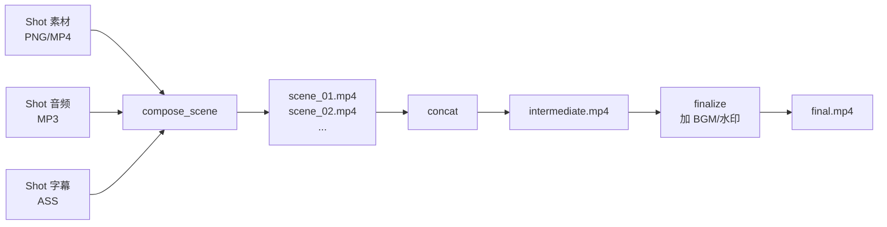

#### 6.7.2 命令模板(精简版)

**① 单镜头合成(静态视觉 + 音频 + 字幕)**:

```bash
ffmpeg -y \
  -loop 1 -t <duration> -i <visual.png> \
  -i <audio.mp3> \
  -vf "subtitles=<subtitle.ass>:fontsdir=<fonts_dir>" \
  -c:v libx264 -preset medium -crf 23 -pix_fmt yuv420p \
  -c:a aac -b:a 192k \
  -shortest \
  scene_01.mp4
```

**② 单镜头合成(动态视觉已是 MP4)**:

```bash
ffmpeg -y \
  -i <visual.mp4> \
  -i <audio.mp3> \
  -vf "subtitles=<subtitle.ass>:fontsdir=<fonts_dir>" \
  -c:v libx264 -preset medium -crf 23 \
  -c:a aac -b:a 192k \
  -map 0:v -map 1:a \
  -shortest \
  scene_02.mp4
```

**③ 多镜头拼接(硬切,最快)**:

```bash
# 先写 filelist.txt:
# file 'scene_01.mp4'
# file 'scene_02.mp4'
# ...

ffmpeg -y -f concat -safe 0 -i filelist.txt -c copy intermediate.mp4
```

**④ 多镜头拼接(xfade 转场)**:

```bash
# xfade 需要重编码,较慢
ffmpeg -y \
  -i scene_01.mp4 -i scene_02.mp4 \
  -filter_complex "\
    [0:v][1:v]xfade=transition=fade:duration=0.5:offset=<s1_duration-0.5>[v]; \
    [0:a][1:a]acrossfade=d=0.5[a]" \
  -map "[v]" -map "[a]" \
  -c:v libx264 -c:a aac \
  scene_12_merged.mp4
```

**⑤ 字幕烧录(ASS 样式)**:

推荐用 ASS(Advanced SubStation Alpha)而非 SRT,可以精细控制字体/颜色/位置/动画。

```
# shot_01.ass
[Script Info]
ScriptType: v4.00+
PlayResX: 1080
PlayResY: 1920

[V4+ Styles]
Format: Name, Fontname, Fontsize, PrimaryColour, OutlineColour, Outline, Shadow, Alignment, MarginL, MarginR, MarginV
Style: Default,Noto Sans CJK SC,56,&H00FFFFFF,&H00000000,3,1,2,40,40,200

[Events]
Format: Layer, Start, End, Style, Text
Dialogue: 0,0:00:00.00,0:00:02.50,Default,,公司赚的钱跟你没关系
Dialogue: 0,0:00:02.50,0:00:05.00,Default,,{\c&H00FFFF&}注意这句话
```

**⑥ 添加 BGM**:

```bash
ffmpeg -y \
  -i intermediate.mp4 \
  -i bgm.mp3 \
  -filter_complex "\
    [1:a]volume=0.15,aloop=loop=-1:size=2e+09[bgm]; \
    [0:a][bgm]amix=inputs=2:duration=first:dropout_transition=2[aout]" \
  -map 0:v -map "[aout]" \
  -c:v copy -c:a aac -b:a 192k \
  final.mp4
```

**⑦ 最终导出(抖音优化)**:

```bash
ffmpeg -y \
  -i input.mp4 \
  -c:v libx264 -profile:v high -level 4.0 \
  -preset slow -crf 20 \
  -pix_fmt yuv420p \
  -c:a aac -b:a 192k -ar 44100 \
  -movflags +faststart \
  -r 30 \
  final.mp4
```

关键参数说明:

| 参数 | 作用 |
|------|------|
| `-preset slow` | 压缩质量好,编码慢(可接受) |
| `-crf 20` | 质量高(数字小=质量高) |
| `-pix_fmt yuv420p` | 确保兼容所有播放器 |
| `-movflags +faststart` | moov atom 前置,支持边下边播 |
| `-r 30` | 抖音推荐帧率 |

#### 6.7.3 命令生成代码结构

```python
# src/videoflow/renderers/ffmpeg/commands.py

def build_compose_scene_cmd(shot: Shot, paths: ScenePaths) -> list[str]:
    """生成单镜头合成命令(列表形式,避免 shell 注入)"""
    if paths.visual.suffix == ".png":
        return _static_visual_cmd(shot, paths)
    else:
        return _dynamic_visual_cmd(shot, paths)

def build_concat_cmd(scene_files: list[Path], output: Path,
                     use_xfade: bool = True) -> list[str]:
    if use_xfade:
        return _xfade_concat_cmd(scene_files, output)
    else:
        return _simple_concat_cmd(scene_files, output)

def build_finalize_cmd(input_path: Path, output_path: Path,
                       bgm: Path | None = None, **opts) -> list[str]:
    ...
```

所有命令**经过单元测试验证**(§8.1),确保在不同 FFmpeg 版本下命令有效。

---

## 第七部分 · 关键工程细节

### 7.1 音画同步机制

#### 7.1.1 核心原则:"声先画后"

短视频制作的工程常识:**先有音频,画面配合音频**。Videoflow 的实现方式:

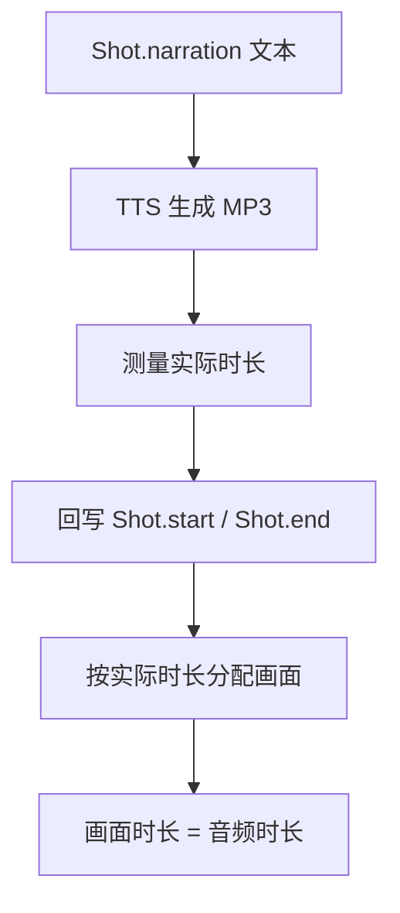

**为什么不反过来**?如果先定画面时长,TTS 为了适配必须拉速或塞内容,语音不自然。反过来画面可以通过 hold 单帧、动画延缓等方式适配音频,质量不受损。

#### 7.1.2 时间轴回写

```python
# src/videoflow/agent/nodes/tts.py 核心片段

async def tts_node(state: VideoflowState) -> dict:
    shotlist = state["shotlist"]
    updated_shots = []
    running_time = 0.0

    for shot in shotlist.shots:
        # 1. TTS 生成音频
        audio_result = await tts_client.call_tool("synthesize", {
            "text": shot.narration,
            "voice": shot.tts_voice,
            "output_path": f"audio/{shot.shot_id}.mp3",
            "speed": shot.tts_speed or 1.0,
        })

        # 2. 用实际时长覆盖原定时长
        shot.start = running_time
        shot.end = running_time + audio_result["duration"]
        shot.audio_file = audio_result["output_path"]
        running_time = shot.end

        updated_shots.append(shot)

    shotlist.shots = updated_shots
    shotlist.actual_duration = running_time

    return {"shotlist": shotlist}
```

#### 7.1.3 字幕对齐精度

Paraformer 的对齐精度:**中文单词级 ±50ms**。这足以让字幕和音频感觉同步。

```python
# src/videoflow/agent/nodes/align.py 核心片段

async def align_node(state: VideoflowState) -> dict:
    subtitles = []
    for shot in state["shotlist"].shots:
        result = await align_client.call_tool("align_subtitle", {
            "audio_path": str(shot.audio_file),
            "reference_text": shot.narration,
            "output_path": f"audio/{shot.shot_id}.ass",
            "format": "ass",
            "granularity": "word",
            "provider": config["providers"]["subtitle_align"]["default"],
        })
        shot.subtitle_file = Path(result["output_path"])
        subtitles.append(shot.subtitle_file)

    return {"subtitle_files": subtitles}
```

#### 7.1.4 画面关键时刻锚点

部分动画(如图表数据跳动)需要对齐旁白关键词。通过在 Shot.visual_spec 里定义锚点:

```json
{
  "shot_id": "S03",
  "visual": {
    "type": "chart",
    "chart_type": "bar",
    "data": {
      "labels": ["A 股", "港股", "美股"],
      "values": [1.8, 3.5, 6.2]
    },
    "animation_anchors": [
      {"keyword": "A 股", "action": "highlight_bar", "bar_index": 0},
      {"keyword": "美股", "action": "highlight_bar", "bar_index": 2}
    ]
  }
}
```

对齐后从 SRT/ASS 提取关键词时间戳,生成 Remotion props 传入:

```json
{
  "animation_timeline": [
    {"time": 3.2, "action": "highlight_bar", "bar_index": 0},
    {"time": 8.7, "action": "highlight_bar", "bar_index": 2}
  ]
}
```

### 7.2 中文字体与渲染

中文字体是跨项目踩坑最多的地方。Videoflow 采用统一策略。

#### 7.2.1 字体清单(打包发布)

| 字体 | 用途 | 许可 | 打包 |
|------|------|------|------|
| Noto Sans CJK SC (Regular/Bold) | 默认中文字体 | SIL OFL | ✅ 打包 |
| Inter (Regular/Bold) | 拉丁字母搭配 | SIL OFL | ✅ 打包 |
| JetBrains Mono | 代码/数字等宽 | SIL OFL | ✅ 打包 |
| 思源宋体 | 衬线场景(可选) | SIL OFL | ❌ 按需下载 |

放置路径:

```
assets/fonts/
├── NotoSansCJKsc-Regular.otf
├── NotoSansCJKsc-Bold.otf
├── Inter-Regular.ttf
├── Inter-Bold.ttf
└── JetBrainsMono-Regular.ttf
```

#### 7.2.2 各渲染器的字体配置

**Mermaid CLI**:通过 puppeteer config 指定:

```json
// mcp_servers/mermaid_server/puppeteer-config.json
{
  "args": ["--font-render-hinting=none"],
  "executablePath": "/usr/bin/chromium",
  "defaultViewport": { "deviceScaleFactor": 2 }
}
```

同时在 mermaid theme 变量里设置:

```js
themeVariables: {
  fontFamily: "Noto Sans CJK SC, sans-serif",
  fontSize: "32px"
}
```

**Remotion**:在 React 组件里 `loadFont`:

```tsx
import { loadFont } from "@remotion/google-fonts/NotoSansSc";

const { fontFamily } = loadFont();

export const Chart: React.FC = () => (
  <div style={{ fontFamily }}>...</div>
);
```

或本地字体:

```tsx
import { staticFile } from "remotion";

const font = new FontFace(
  "NotoSansCJK",
  `url('${staticFile("fonts/NotoSansCJKsc-Bold.otf")}') format('opentype')`
);
document.fonts.add(font);
await font.load();
```

**Playwright**:启动时注入字体:

```python
context = await browser.new_context(
    viewport={"width": 1080, "height": 1920},
    locale="zh-CN",
)
await context.add_init_script(
    """
    const style = document.createElement('style');
    style.textContent = `
      @font-face {
        font-family: 'Noto Sans CJK SC';
        src: url('file://<fonts_dir>/NotoSansCJKsc-Regular.otf');
      }
      body { font-family: 'Noto Sans CJK SC', sans-serif; }
    `;
    document.head.appendChild(style);
    """
)
```

**FFmpeg**:字幕烧录时指定 fonts 目录:

```bash
-vf "subtitles=<subtitle.ass>:fontsdir=/path/to/assets/fonts"
```

#### 7.2.3 中文字体检查工具

`video-agent doctor` 会检查字体配置:

```
$ video-agent doctor
✓ Python 3.11.5
✓ Node.js 20.11.0
✓ FFmpeg 6.0
✓ Fonts:
  ✓ Noto Sans CJK SC (Regular) - 19MB
  ✓ Noto Sans CJK SC (Bold)    - 19MB
  ✓ Inter (Regular)            - 340KB
  ⚠ Inter (Bold)               - Missing (not critical)
✓ MCP Servers: 8/8 installed
⚠ Playwright browsers: chromium not installed
  → Run: playwright install chromium
```

### 7.3 跨语言调度:Python ↔ Node

Python(主控)需要调用 Node(Remotion / Playwright / Mermaid)。选择**subprocess**而非 HTTP,简化部署。

#### 7.3.1 调用模板

```python
# src/videoflow/renderers/node_bridge.py

import asyncio
import json
from pathlib import Path

async def invoke_node_mcp(
    server_binary: Path,
    tool: str,
    args: dict,
    timeout: int = 300,
) -> dict:
    """调用 Node 写的 MCP Server,通过 stdio"""
    proc = await asyncio.create_subprocess_exec(
        "node", str(server_binary),
        stdin=asyncio.subprocess.PIPE,
        stdout=asyncio.subprocess.PIPE,
        stderr=asyncio.subprocess.PIPE,
    )
    request = {
        "jsonrpc": "2.0",
        "method": "tools/call",
        "params": {"name": tool, "arguments": args},
        "id": 1,
    }
    proc.stdin.write((json.dumps(request) + "\n").encode())
    await proc.stdin.drain()
    proc.stdin.close()

    try:
        stdout, stderr = await asyncio.wait_for(
            proc.communicate(), timeout=timeout
        )
    except asyncio.TimeoutError:
        proc.kill()
        raise NodeInvocationTimeout(f"{tool} timed out after {timeout}s")

    if proc.returncode != 0:
        raise NodeInvocationFailed(stderr.decode())

    response = json.loads(stdout.decode())
    if "error" in response:
        raise NodeInvocationError(response["error"]["message"])
    return response["result"]
```

#### 7.3.2 Remotion 特殊调用

Remotion 的 `render` CLI 用法不是 MCP,需要单独封装:

```python
# src/videoflow/renderers/remotion_bridge.py

async def render_remotion_composition(
    composition_id: str,
    props: dict,
    output_path: Path,
    duration: float,
    fps: int = 30,
) -> Path:
    """调用 npx remotion render"""
    props_file = output_path.with_suffix(".props.json")
    props_file.write_text(json.dumps(props))

    cmd = [
        "npx", "remotion", "render",
        "remotion/src/Root.tsx",
        composition_id,
        str(output_path),
        f"--props={props_file}",
        f"--frames=0-{int(duration * fps)}",
        "--log=error",
    ]

    proc = await asyncio.create_subprocess_exec(
        *cmd,
        stdout=asyncio.subprocess.PIPE,
        stderr=asyncio.subprocess.PIPE,
        cwd=Path.cwd(),
    )
    stdout, stderr = await proc.communicate()

    if proc.returncode != 0:
        raise RemotionRenderFailed(stderr.decode())

    return output_path
```

### 7.4 并行与资源管理

#### 7.4.1 并行策略

| 层级 | 并行方式 | 原因 |
|------|---------|------|
| Node 之间 | 不并行(除 asset_factory ↔ tts) | 流水线本质是串行 |
| Shot 之间(同 Node 内) | `asyncio.gather` | IO 密集 |
| MCP Server 之间 | 每 Server 独立进程 | 隔离失败 |

#### 7.4.2 资源限制

```toml
# config.toml
[runtime]
max_concurrent_renders = 4      # 同时运行的 Remotion 进程数
max_concurrent_tts = 8          # 同时运行的 TTS 请求数
max_memory_per_render_mb = 2048

[ffmpeg]
threads = 0                     # 0 = 自动检测 CPU 核数
```

实现通过 `asyncio.Semaphore`:

```python
render_sem = asyncio.Semaphore(config.max_concurrent_renders)

async def render_shot(shot: Shot):
    async with render_sem:
        return await _do_render(shot)
```

#### 7.4.3 中间产物磁盘管理

```python
# 自动清理策略
[workspace]
retention_days = 30              # 保留期
auto_cleanup_on_success = false  # 成功后是否立即清理中间产物
preserve_final_mp4 = true        # 即使过期也保留 final.mp4

# CLI 手动清理
# video-agent clean --older-than 7d
# video-agent clean --project proj_xxx
```

### 7.5 缓存与幂等

#### 7.5.1 Shot 级缓存键

```python
def shot_cache_key(shot: Shot) -> str:
    """基于 Shot 内容生成 SHA256"""
    content = {
        "narration": shot.narration,
        "visual": shot.visual.model_dump(),
        "renderer": shot.renderer.value,
        "tts_voice": shot.tts_voice,
        "tts_speed": shot.tts_speed,
    }
    return hashlib.sha256(
        json.dumps(content, sort_keys=True).encode()
    ).hexdigest()[:16]
```

#### 7.5.2 缓存存储布局

```
~/.videoflow/cache/
├── tts/
│   ├── <hash>.mp3
│   └── <hash>.meta.json
├── visuals/
│   ├── <hash>.png
│   ├── <hash>.mp4
│   └── <hash>.meta.json
└── stock/
    └── pexels/
        └── <video_id>.mp4
```

#### 7.5.3 缓存命中策略

```python
async def get_or_compute(key: str, compute_fn, cache_dir: Path) -> Path:
    cached = cache_dir / f"{key}.mp3"
    if cached.exists():
        log.info(f"Cache hit: {key}")
        return cached

    log.info(f"Cache miss: {key}, computing...")
    result = await compute_fn()
    shutil.copy(result, cached)
    return cached
```

用户编辑 Shot 的旁白 → 缓存键变化 → 重新生成 TTS。只改样式不影响 TTS 的缓存 → 命中 → 快速。

### 7.6 配置管理

#### 7.6.1 三层配置优先级

```
1. CLI 参数                        (最高优先级)
   ↓ 覆盖
2. ~/.videoflow/user_profile.yaml   (用户偏好)
   ↓ 覆盖
3. ~/.videoflow/config.toml          (系统配置)
   ↓ 覆盖
4. 代码内置默认                      (兜底)
```

#### 7.6.2 `config.toml` 完整示例

```toml
# ~/.videoflow/config.toml

[runtime]
workspace_root = "~/.videoflow/workspace"
max_concurrent_renders = 4
max_concurrent_tts = 8
log_level = "INFO"

[review]
default_mode = "light"
polling_interval_seconds = 2
auto_approve_timeout = 3600       # Light 模式:超时自动通过

[providers.llm]
default = "claude"
fallback = ["deepseek"]

[providers.llm.claude]
api_key = "${ANTHROPIC_API_KEY}"
model = "claude-sonnet-4-7"
max_tokens = 4096

[providers.llm.deepseek]
api_key = "${DEEPSEEK_API_KEY}"
model = "deepseek-v3"

[providers.tts]
default = "edge"
fallback = []

[providers.tts.edge]
# edge-tts 无需 api_key

[providers.tts.azure]
api_key = "${AZURE_TTS_KEY}"
region = "eastasia"

[providers.subtitle_align]
default = "paraformer"
fallback = ["whisper"]

[providers.subtitle_align.paraformer]
model_size = "large"
device = "cpu"

[providers.subtitle_align.whisper]
model_size = "large-v3"
language = "zh"

[providers.stock]
default = "pexels"

[providers.stock.pexels]
api_key = "${PEXELS_API_KEY}"

[ffmpeg]
binary = "ffmpeg"                 # 可指定绝对路径
threads = 0
crf = 23
preset = "medium"

[rendering]
default_fps = 30
default_width = 1080
default_height = 1920
```

#### 7.6.3 环境变量引用

`${VAR_NAME}` 语法自动展开,避免 API Key 写进配置文件。`.env` 文件自动加载:

```
# .env
ANTHROPIC_API_KEY=sk-ant-...
PEXELS_API_KEY=...
```

---

## 第八部分 · 测试与质量保障

### 8.1 单元测试策略

#### 8.1.1 测试金字塔

```
       ┌─────────┐
       │  E2E 2  │        2 个端到端测试(explainer + news_digest 各 1)
       ├─────────┤
       │ Integr. │        30+ 集成测试(Node、MCP、Provider)
       │   30+   │
       ├─────────┤
       │  Unit   │        300+ 单元测试(Pydantic、工具函数、纯逻辑)
       │  300+   │
       └─────────┘
```

#### 8.1.2 分层测试覆盖目标

| 层级 | 覆盖率目标 | 测试内容 |
|------|-----------|---------|
| 数据模型(Pydantic) | 100% | 字段校验、状态转移 |
| 工具函数(utils) | ≥ 90% | 缓存键、FFmpeg 命令构造、字体处理 |
| Node 逻辑 | ≥ 80% | 输入/输出、错误处理 |
| MCP Server | ≥ 70% | 工具契约、异常分支 |
| Provider | ≥ 60% | Mock 模式 |

#### 8.1.3 关键测试用例清单

**Pydantic 模型**:

```python
def test_shot_requires_positive_duration():
    with pytest.raises(ValidationError):
        Shot(shot_id="S01", start=5, end=3, ...)

def test_shotlist_rejects_overlapping_shots():
    ...

def test_visual_spec_discriminated_union():
    # ChartVisual vs DiagramVisual 的多态
    ...
```

**FFmpeg 命令构造**:

```python
def test_compose_scene_static_visual():
    shot = Shot(..., renderer=Renderer.STATIC)
    cmd = build_compose_scene_cmd(shot, ...)
    assert "-loop 1" in " ".join(cmd)
    assert "-shortest" in cmd

def test_compose_scene_dynamic_visual():
    shot = Shot(..., renderer=Renderer.REMOTION)
    cmd = build_compose_scene_cmd(shot, ...)
    assert "-loop 1" not in " ".join(cmd)
```

**缓存键稳定性**:

```python
def test_cache_key_stable_across_runs():
    shot = Shot(shot_id="S01", narration="hello", ...)
    key1 = shot_cache_key(shot)
    key2 = shot_cache_key(shot.model_copy())
    assert key1 == key2

def test_cache_key_changes_on_content_change():
    shot1 = Shot(..., narration="hello")
    shot2 = Shot(..., narration="hello world")
    assert shot_cache_key(shot1) != shot_cache_key(shot2)
```

### 8.2 集成测试策略

#### 8.2.1 LangGraph 快照测试(不调真实 LLM)

```python
# tests/integration/test_parser_node.py
async def test_parser_node_with_fixture_llm():
    # 用 fixture 替换 LLM 响应
    mock_llm_response = load_fixture("explainer_stock_myths.shotlist.json")

    with patch("litellm.acompletion", return_value=mock_llm_response):
        state = VideoflowState(
            input_text=load_fixture("explainer_stock_myths.md"),
            template="explainer",
            target_duration=60,
        )
        result = await parser_node(state)

    assert result["shotlist"].shots.__len__() == 6
    assert result["shotlist"].shots[0].shot_id == "S01"
```

#### 8.2.2 MCP Server 契约测试

```python
# tests/integration/test_mcp_mermaid.py
async def test_mermaid_server_renders_simple_diagram():
    async with start_mcp_server("videoflow-mermaid") as client:
        result = await client.call_tool("render_diagram", {
            "mermaid_code": "graph LR; A --> B",
            "output_path": tmp_path / "test.png",
        })

    assert Path(result["output_path"]).exists()
    assert result["width"] == 1080
```

#### 8.2.3 真实调用的 Smoke Test(按标签隔离)

```python
# tests/smoke/test_real_llm.py
@pytest.mark.smoke         # 仅 make smoke 运行
@pytest.mark.api_cost      # 标记为消耗 API 额度
async def test_real_claude_parsing():
    """真实调 Claude API 验证端到端,仅在发布前跑"""
    ...
```

### 8.3 质量自动评估

#### 8.3.1 三层自动检查

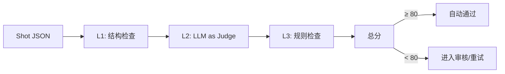

#### 8.3.2 L1 结构检查(硬性)

- Shot 数量 3-15 之间
- 总时长在 [target * 0.8, target * 1.2] 范围内
- 每个 Shot 的 `narration` 非空
- 每个 Shot 的 `visual` 通过 Pydantic 校验
- 相邻 Shot 时间戳无重叠

#### 8.3.3 L2 LLM-as-Judge(软性)

给一个评审 Agent 看整个 ShotList,打分 0-100:

```python
JUDGE_PROMPT = """
你是短视频脚本审稿人。按以下 5 个维度给分(每项 20 分):
1. 开场 Hook 是否抓人(前 3 秒)
2. 论证结构是否清晰
3. 画面类型与内容匹配度
4. 语言是否口语化、适合配音
5. 结尾是否有记忆点

输出 JSON: {"total": int, "breakdown": {...}, "feedback": "..."}
"""

async def judge_shotlist(shotlist: ShotList) -> JudgeResult:
    response = await llm.complete([
        {"role": "system", "content": JUDGE_PROMPT},
        {"role": "user", "content": shotlist.model_dump_json()},
    ], response_format="json")
    return JudgeResult.model_validate_json(response.content)
```

#### 8.3.4 L3 规则检查(终片)

```python
async def check_final_video(video_path: Path, shotlist: ShotList) -> CheckReport:
    report = CheckReport()

    # 1. ffprobe 取元数据
    probe = await ffprobe(video_path)

    # 2. 时长检查
    if abs(probe.duration - shotlist.actual_duration) > 0.5:
        report.warnings.append(f"时长偏差 {delta}s")

    # 3. 分辨率
    if (probe.width, probe.height) != (1080, 1920):
        report.errors.append(f"分辨率错误: {probe.width}x{probe.height}")

    # 4. 黑帧检测
    black_frames = await ffmpeg_blackdetect(video_path)
    if black_frames:
        report.warnings.append(f"发现 {len(black_frames)} 段黑帧")

    # 5. 音频正常性
    if probe.audio_streams == 0:
        report.errors.append("无音频轨道")
    elif probe.peak_db < -30:
        report.warnings.append("音频可能过轻")

    return report
```

### 8.4 CI/CD

#### 8.4.1 GitHub Actions 工作流

`.github/workflows/ci.yml`:

```yaml
name: CI

on:
  push:
    branches: [main, develop]
  pull_request:
    branches: [main]

jobs:
  lint:
    runs-on: ubuntu-latest
    steps:
      - uses: actions/checkout@v4
      - uses: actions/setup-python@v5
        with: { python-version: "3.11" }
      - run: pip install uv
      - run: uv sync
      - run: uv run ruff check .
      - run: uv run mypy src/videoflow

  test-unit:
    runs-on: ${{ matrix.os }}
    strategy:
      matrix:
        os: [ubuntu-latest, macos-latest]
        python: ["3.11", "3.12"]
    steps:
      - uses: actions/checkout@v4
      - uses: actions/setup-python@v5
        with: { python-version: "${{ matrix.python }}" }
      - uses: actions/setup-node@v4
        with: { node-version: "20" }
      - run: |
          sudo apt-get install ffmpeg      # linux only
          # or: brew install ffmpeg        # macos
      - run: uv sync
      - run: uv run pytest tests/unit -v --cov

  test-integration:
    runs-on: ubuntu-latest
    needs: test-unit
    steps:
      - uses: actions/checkout@v4
      - ... (完整环境)
      - run: uv run pytest tests/integration -v

  test-smoke:
    runs-on: ubuntu-latest
    if: github.event_name == 'push' && github.ref == 'refs/heads/main'
    needs: test-integration
    steps:
      - ... (完整环境 + API Keys from secrets)
      - run: uv run pytest tests/smoke -v

  build-docker:
    runs-on: ubuntu-latest
    needs: test-unit
    if: github.event_name == 'push'
    steps:
      - uses: actions/checkout@v4
      - uses: docker/build-push-action@v5
        with:
          context: .
          tags: videoflow:${{ github.sha }}
```

#### 8.4.2 发布流程

```
develop 分支 → PR 到 main → CI 通过 → Squash merge
     ↓
main 分支 → 打 tag(v1.0.0)→ 触发 release workflow
     ↓
自动构建 & 发布:
  - PyPI 包(videoflow)
  - Docker 镜像(videoflow/videoflow:1.0.0)
  - GitHub Release(含 CHANGELOG)
```

**发布清单(每次 release 前人工检查)**:

- [ ] CHANGELOG.md 更新
- [ ] 版本号一致(pyproject.toml / package.json)
- [ ] 双语 README 同步
- [ ] `examples/` 中的所有示例跑通
- [ ] Docker compose up 一键启动验证
- [ ] Smoke tests 全绿
- [ ] `video-agent doctor` 在干净环境通过

---

> **第 2 卷完**(第 6-8 章)。
>
> 下一卷将输出:第 9-12 部分(开源发布规划、MVP 里程碑、风险与应对、附录含《股市反常识》实战样例),保持上下文连贯。请审阅本卷。

## 第九部分 · 开源发布规划

Videoflow 从第一天就按**成熟开源项目**的标准规划,避免"先写代码再补工程化"。本章覆盖:仓库、文档、示例、社区、法律合规。

### 9.1 License 与法律

#### 9.1.1 项目 License

**选定:MIT License**

**选择理由**:

| License | 优点 | 缺点 | 判断 |
|---------|------|------|------|
| **MIT** | 最宽松,商用/闭源/再发布都行;社区接受度最高 | 专利条款弱 | ✅ 采用 |
| Apache 2.0 | 含专利授权条款,法律更严谨 | 稍复杂 | 次选 |
| GPL v3 | 强 copyleft,衍生作品必须开源 | 商业用户抵触,降低采用率 | ❌ |
| BSD 3-Clause | 类似 MIT | 社区势头弱于 MIT | ❌ |

#### 9.1.2 依赖 License 兼容性审计

```
主要依赖 License 矩阵:

MIT 兼容(✅ 可直接使用):
  - LangGraph (MIT)
  - LangExtract (Apache 2.0)
  - LiteLLM (MIT)
  - edge-tts (MIT)
  - faster-whisper (MIT)
  - FunASR (Apache 2.0)
  - Streamlit (Apache 2.0)
  - Mermaid (MIT)
  - Playwright (Apache 2.0)

LGPL 依赖(⚠️ 动态链接,需注意):
  - FFmpeg (LGPL,默认构建)
  → 用户只要不静态链接或修改 FFmpeg 源码,不需开源自己代码

Remotion 特殊许可(🟡):
  - 对年收入 ≥ $1M USD 的公司需购买企业许可
  - 个人用户 / 小公司 / 非营利 / 政府免费
  → 在 README 和 INSTALL 文档显著位置说明

Apache 2.0 / SIL OFL 字体:
  - Noto Sans CJK SC (SIL OFL) - 可打包分发
  - Inter (SIL OFL) - 可打包分发
```

#### 9.1.3 Videoflow 仓库的 LICENSE 文件

```
MIT License

Copyright (c) 2026 Videoflow Contributors

Permission is hereby granted, free of charge, to any person obtaining a copy
of this software and associated documentation files (the "Software"), to deal
in the Software without restriction, including without limitation the rights
to use, copy, modify, merge, publish, distribute, sublicense, and/or sell
copies of the Software, and to permit persons to whom the Software is
furnished to do so, subject to the following conditions:

The above copyright notice and this permission notice shall be included in all
copies or substantial portions of the Software.

THE SOFTWARE IS PROVIDED "AS IS", WITHOUT WARRANTY OF ANY KIND, EXPRESS OR
IMPLIED, INCLUDING BUT NOT LIMITED TO THE WARRANTIES OF MERCHANTABILITY,
FITNESS FOR A PARTICULAR PURPOSE AND NONINFRINGEMENT. IN NO EVENT SHALL THE
AUTHORS OR COPYRIGHT HOLDERS BE LIABLE FOR ANY CLAIM, DAMAGES OR OTHER
LIABILITY, WHETHER IN AN ACTION OF CONTRACT, TORT OR OTHERWISE, ARISING FROM,
OUT OF OR IN CONNECTION WITH THE SOFTWARE OR THE USE OR OTHER DEALINGS IN THE
SOFTWARE.
```

### 9.2 代码仓库结构

```
videoflow/
├── README.md                    # 英文主 README(带首屏 GIF demo)
├── README_zh.md                 # 中文 README
├── LICENSE                      # MIT
├── CHANGELOG.md                 # Keep a Changelog 格式
├── CONTRIBUTING.md              # 贡献指南
├── CODE_OF_CONDUCT.md           # Contributor Covenant
├── pyproject.toml               # uv / pip 配置
├── docker-compose.yml           # 一键部署
├── Dockerfile                   # 主容器
├── .env.example                 # 环境变量模板
├── .github/
│   ├── workflows/
│   │   ├── ci.yml
│   │   ├── release.yml
│   │   └── stale.yml
│   ├── ISSUE_TEMPLATE/
│   │   ├── bug_report.md
│   │   ├── feature_request.md
│   │   ├── template_proposal.md
│   │   └── provider_proposal.md
│   └── PULL_REQUEST_TEMPLATE.md
├── src/
│   └── videoflow/
│       ├── __init__.py
│       ├── cli.py               # CLI 入口
│       ├── agent/
│       │   ├── graph.py         # LangGraph 主图
│       │   ├── state.py         # VideoflowState 定义
│       │   └── nodes/
│       │       ├── base.py
│       │       ├── parser.py
│       │       ├── review.py
│       │       ├── asset_factory.py
│       │       ├── tts.py
│       │       ├── align.py
│       │       ├── composer.py
│       │       └── output.py
│       ├── models/              # Pydantic 模型
│       │   ├── project.py
│       │   ├── shot.py
│       │   └── asset.py
│       ├── providers/           # Provider 插件
│       │   ├── base.py
│       │   ├── llm/
│       │   ├── tts/
│       │   ├── subtitle_align/
│       │   └── stock/
│       ├── mcp_client/          # MCP 客户端
│       │   └── __init__.py
│       ├── renderers/           # 跨语言渲染器封装
│       │   ├── node_bridge.py
│       │   ├── remotion_bridge.py
│       │   └── ffmpeg/
│       │       ├── commands.py
│       │       └── executor.py
│       ├── review/              # Streamlit UI
│       │   ├── app.py
│       │   ├── pages/
│       │   │   ├── project_list.py
│       │   │   ├── project_detail.py
│       │   │   └── config.py
│       │   └── components/
│       ├── templates/           # 内置模板(运行时数据)
│       │   ├── explainer/
│       │   └── news_digest/
│       └── utils/
│           ├── config.py
│           ├── cache.py
│           ├── logger.py
│           └── validators.py
├── mcp_servers/                 # MCP Servers(独立进程)
│   ├── parser/                  # Python
│   │   ├── server.py
│   │   └── pyproject.toml
│   ├── mermaid/                 # Node
│   │   ├── index.js
│   │   └── package.json
│   ├── remotion/                # Node
│   │   ├── index.js
│   │   └── package.json
│   ├── playwright/              # Node
│   ├── tts/                     # Python
│   ├── align/                   # Python
│   ├── pexels/                  # Python
│   └── ffmpeg/                  # Python
├── remotion/                    # Remotion 项目
│   ├── package.json
│   ├── remotion.config.ts
│   └── src/
│       ├── Root.tsx
│       └── compositions/
│           ├── Chart/
│           ├── Diagram/
│           └── TitleCard/
├── assets/
│   ├── fonts/
│   │   ├── NotoSansCJKsc-Regular.otf
│   │   ├── NotoSansCJKsc-Bold.otf
│   │   ├── Inter-Regular.ttf
│   │   └── Inter-Bold.ttf
│   └── examples/                # README 用的 GIF / 成品视频
├── examples/
│   ├── explainer-stock-myths/   # 《股市反常识》(附录 A)
│   │   ├── README.md
│   │   ├── input.md
│   │   ├── expected_shotlist.json
│   │   └── final.mp4            # 参考成品
│   ├── news-digest-daily/
│   │   ├── README.md
│   │   ├── input.md
│   │   └── final.mp4
│   └── tutorial-quickstart/
│       └── README.md
├── tests/
│   ├── unit/
│   ├── integration/
│   ├── smoke/
│   └── fixtures/
├── docs/
│   ├── quickstart.md            # 5 分钟跑通
│   ├── architecture.md          # 本 PRD 简化版
│   ├── templates-guide.md       # 如何写新模板
│   ├── providers-guide.md       # 如何写新 Provider
│   ├── mcp-servers-guide.md     # 如何写新 MCP Server
│   ├── configuration.md         # 配置详解
│   ├── troubleshooting.md       # 常见问题
│   ├── roadmap.md               # V1 → V2 演进
│   └── zh/                      # 中文版文档
│       ├── quickstart.md
│       ├── architecture.md
│       └── ...
└── SKILL.md                     # Claude Code Skill 入口
```

### 9.3 文档体系

#### 9.3.1 文档分层

```
面向用户(User-facing)              面向开发者(Developer-facing)
─────────────────────              ──────────────────────────────
  README (首页)                       CONTRIBUTING.md
  docs/quickstart.md                  docs/architecture.md (本 PRD)
  docs/configuration.md               docs/templates-guide.md
  docs/troubleshooting.md             docs/providers-guide.md
                                      docs/mcp-servers-guide.md
                                      docs/roadmap.md
```

#### 9.3.2 README 结构(开源成功的关键)

```markdown
# Videoflow 🎬

[One-liner] Turn your text drafts into publish-ready short videos — charts, 
narration, subtitles, all automated.

[Hero GIF 10s] ← 这是必备的

## Quick Start

```bash
# Docker 一键
docker compose up

# Or local
pip install videoflow
video-agent generate draft.md
```

## Features

- ✅ Text → Video in ≤ 10 minutes
- ✅ One-click review (or full auto)
- ✅ Programmatic charts & diagrams (not stock footage soup)
- ✅ 100% FFmpeg-based, no MoviePy pain
- ✅ Plugin system: bring your own TTS / LLM / Template

## Architecture

[Mermaid 图 — 从本 PRD §3.1 截取简化版]

## Examples

- [Finance explainer](examples/explainer-stock-myths/) (视频 thumbnail)
- [Daily news digest](examples/news-digest-daily/)

## Documentation

- [Quickstart](docs/quickstart.md)
- [Architecture](docs/architecture.md)
- [Contribute a template](docs/templates-guide.md)
- [Contribute a provider](docs/providers-guide.md)

## Roadmap

- ✅ V1.0 — Core pipeline, explainer + news_digest templates
- ⏳ V1.5 — Skill Distiller, more templates, HeyGen provider
- 🔮 V2.0 — UniVA Plan-Act, MCP ecosystem, auto memory

## License

MIT. See [LICENSE](LICENSE).

## Acknowledgments

Built on top of [LangGraph](...), [LangExtract](...), [Remotion](...), 
[edge-tts](...), [FunASR](...).
```

#### 9.3.3 Quickstart 文档(必做,承诺 5 分钟)

```markdown
# Videoflow Quickstart

## Prerequisites

- Python 3.11+
- Node.js 20+
- FFmpeg 6+
- 4GB+ RAM (8GB recommended)
- API key from ONE of: Anthropic / OpenAI / DeepSeek

## 5-Minute Setup (Docker)

```bash
git clone https://github.com/YOUR_ORG/videoflow.git
cd videoflow
cp .env.example .env
# Edit .env, add your API key
docker compose up
```

Open http://localhost:8501 in browser.

## 5-Minute Setup (Local)

```bash
# 1. Clone
git clone https://github.com/YOUR_ORG/videoflow.git
cd videoflow

# 2. Install Python deps (uv recommended)
pip install uv
uv sync

# 3. Install Node deps
cd remotion && npm install && cd ..
cd mcp_servers/mermaid && npm install && cd ../..

# 4. Install FFmpeg
# macOS: brew install ffmpeg
# Ubuntu: sudo apt-get install ffmpeg
# Windows (WSL2): same as Ubuntu

# 5. Configure
cp .env.example .env
# Edit .env

# 6. First run
uv run video-agent doctor   # 检查环境
uv run video-agent generate examples/explainer-stock-myths/input.md

# 7. Open UI in another terminal
uv run video-agent ui
```

## Your First Video

[截图 + 分步骤 10 张]
```

#### 9.3.4 Templates Guide(贡献者入口 1)

完整说明"如何写一个新模板",含目录结构、Prompt 规范、Few-shot 示例要求、测试流程。

#### 9.3.5 Providers Guide(贡献者入口 2)

```markdown
# Contributing a New Provider

Videoflow supports pluggable Providers for LLM / TTS / Subtitle Align / Stock.
This guide walks you through adding a new TTS Provider (other types are similar).

## 1. Pick the Provider Interface

Your class must inherit from `BaseTTSProvider`:

```python
from videoflow.providers.tts.base import BaseTTSProvider

class MyCoolTTS(BaseTTSProvider):
    name = "my_cool_tts"

    async def synthesize(self, text, voice, output_path, **kwargs):
        ...
        return TTSResult(
            duration=audio_duration,
            sample_rate=44100,
            output_path=output_path,
        )

    def list_voices(self, locale=None):
        return [
            VoiceInfo(id="alice", locale="en-US", gender="female"),
            ...
        ]

    def health_check(self):
        return self._api_reachable()
```

## 2. Register via Entry Points

In your `pyproject.toml`:

```toml
[project.entry-points."videoflow.tts_providers"]
my_cool_tts = "mypackage.providers:MyCoolTTS"
```

## 3. Add Tests

Under `tests/providers/test_my_cool_tts.py`:

```python
@pytest.mark.asyncio
async def test_synthesize_produces_audio():
    provider = MyCoolTTS({"api_key": "test"})
    result = await provider.synthesize(
        text="Hello world",
        voice="alice",
        output_path=tmp_path / "out.mp3",
    )
    assert result.output_path.exists()
    assert 0.5 < result.duration < 2.0
```

## 4. Document

Add a section to `docs/providers-guide.md`:

- Required API keys / setup
- Supported voices
- Pricing (if relevant)
- Known limitations

## 5. Submit PR

- Include a reference link to the upstream TTS service
- Include a sample audio file (under 100KB) in `assets/samples/`
- Update CHANGELOG.md
```

#### 9.3.6 Roadmap 文档

见第十部分 §10.4。

### 9.4 示例库(`examples/`)

#### 9.4.1 示例的作用

示例**不是装饰**,是:

- 第一次上手用户的"复制模板"
- 贡献者的"参考格式"
- 维护者的"回归测试输入"
- 宣传的"成品展示"

#### 9.4.2 MVP 发布的 3 个示例

| 示例 | 模板 | 用途 | 交付物 |
|------|------|------|-------|
| `explainer-stock-myths` | explainer | 金融科普反常识 | input.md + expected_shotlist.json + final.mp4 |
| `news-digest-daily` | news_digest | 新闻日更摘要 | 3 天的真实新闻 input + final.mp4 |
| `tutorial-quickstart` | explainer | 快速上手教程 | 最简单输入,引导新用户 |

#### 9.4.3 示例目录约定

```
examples/explainer-stock-myths/
├── README.md                    # 本例说明
├── input.md                     # 原始输入
├── config.override.toml         # 本例特定配置(可选)
├── expected_shotlist.json       # 参考输出(回归测试用)
├── final.mp4                    # 参考成品
└── thumbnail.png                # 首帧缩略图
```

每个示例的 README 统一结构:

```markdown
# Example: Stock Market Myths Explainer

**Template**: explainer
**Duration**: 62s
**Language**: 中文
**Difficulty**: Intermediate

## What it demonstrates

- Mermaid flowchart in motion
- Bar chart with dynamic highlight
- Dark color scheme with brand accent
- Mixed static + motion visuals

## How to run

```bash
video-agent generate examples/explainer-stock-myths/input.md \
  --review light \
  --template explainer
```

## Expected output

See [final.mp4](final.mp4) (62 seconds, 1080x1920 MP4).

## Key design choices

- S02 uses `renderer=remotion` for diagram motion (not static mermaid)
- Duration target = 60s but actual = 62s (TTS timing won)
```

### 9.5 社区建设

#### 9.5.1 CONTRIBUTING.md 关键点

```markdown
# Contributing to Videoflow

Thanks for your interest! Videoflow welcomes contributions.

## Ways to Contribute (by difficulty)

### 🟢 Easy (no code)
- Report bugs → [Bug template](...)
- Suggest features → [Feature template](...)
- Improve docs → direct PR to `docs/`
- Add translations → `docs/<lang>/`
- Share your created videos in Showcase

### 🟡 Medium
- Contribute a new Template → [Templates Guide](docs/templates-guide.md)
- Add an example to `examples/`
- Write tests for uncovered code

### 🔴 Hard
- Contribute a new Provider → [Providers Guide](docs/providers-guide.md)
- Contribute a new MCP Server → [MCP Servers Guide](docs/mcp-servers-guide.md)
- Core engine improvements → discuss in issue first

## Development Setup

[Link to quickstart + additional dev deps]

## Code Style

- Python: `ruff format` + `ruff check` + `mypy`
- TypeScript: `prettier` + `eslint`
- Commit: Conventional Commits (`feat:`, `fix:`, `docs:`, ...)

## Pull Request Checklist

- [ ] Tests pass (`make test`)
- [ ] Docs updated (if user-visible change)
- [ ] CHANGELOG entry added under `[Unreleased]`
- [ ] Small, focused scope (one concern per PR)
```

#### 9.5.2 Issue / PR 模板

`.github/ISSUE_TEMPLATE/bug_report.md`:

```markdown
---
name: Bug report
about: Report something that's broken
labels: bug
---

### What happened
<!-- short description -->

### Expected
<!-- what should have happened -->

### Reproduction
1.
2.
3.

### Environment
- Videoflow version:
- OS:
- Python version:
- Node version:
- FFmpeg version:

### `video-agent doctor` output
```
[paste here]
```

### Project ID / Logs
Project: proj_xxxxxxxx (attach `workspace/proj_xxx/worker.log` if possible)
```

#### 9.5.3 交流渠道

| 渠道 | 用途 | 启用时机 |
|------|------|---------|
| GitHub Discussions | 讨论 / Q&A / Showcase | 仓库开放即启用 |
| GitHub Issues | Bug / Feature Request | 仓库开放即启用 |
| Discord / 微信群 | 实时交流 | star 数 ≥ 500 后建 |

### 9.6 与其他开源生态的兼容承诺

#### 9.6.1 Claude Code 集成

通过 `SKILL.md` 成为 Claude Code 可调用的 skill。见 §6.1.3。

#### 9.6.2 Hermes Agent / OpenHarness 集成

通过 MCP 协议,Videoflow 的任何 MCP Server 都可以被 Hermes / OpenHarness 调用。典型场景:

```
Hermes Agent (on $5 VPS)
  ↓ MCP
  videoflow-parser (remote)
  videoflow-ffmpeg (remote)
```

用户手机 → Telegram → Hermes → Videoflow 生成视频 → 推回手机。

Videoflow 官方提供**参考集成示例**:`examples/hermes-integration/README.md`。

#### 9.6.3 agentskills.io 对齐

Videoflow 的 `SKILL.md` 遵循 [agentskills.io](https://agentskills.io) 开放标准,便于在 Hermes / OpenClaw / Claude Code 间迁移。

#### 9.6.4 对标竞品的差异化定位(README 中展示)

| 对比项 | MoneyPrinterTurbo | NarratoAI | ViMax | **Videoflow** |
|--------|-------------------|-----------|-------|--------------|
| 输入 | 主题关键词 | 已有视频 | 创意/剧本 | **结构化文本** |
| 核心输出 | 库存素材拼接 | 视频解说 | 电影级叙事 | **精准图表 + 解说** |
| 图表支持 | ❌ | ❌ | ❌ | **✅ Mermaid + Remotion** |
| 人工审核 | 无 | 无 | 无 | **1 次点击(Light)** |
| 插件扩展 | 弱 | 弱 | 弱 | **MCP + Provider** |
| 开源 License | MIT | 限学习 | MIT | **MIT** |

---

## 第十部分 · MVP 范围与里程碑

### 10.1 MVP(V1.0)范围

#### 10.1.1 必做清单

```
✅ 架构骨架
   - LangGraph 主图 + SQLite checkpoint
   - 8 个 MCP Server 全部实现
   - 4 类 Provider(各自至少 1 个默认实现)

✅ 输入输出
   - CLI(generate / status / list / resume / ui / doctor / config)
   - Claude Code SKILL.md
   - 文件输入(.md / .txt / stdin)
   - 文件输出(.mp4 + thumbnail.png + metadata.json)

✅ 模板
   - explainer(科普反常识)
   - news_digest(新闻摘要)

✅ 审核
   - Auto / Light / Deep 三档模式
   - Streamlit UI(项目列表 + 3 种审核页)

✅ 视觉能力
   - Mermaid 流程图(静态)
   - Remotion 组件(动态图表 + 动态标题卡)
   - Playwright HTML 录屏
   - Pexels 库存视频

✅ 音频能力
   - edge-tts(中英文默认)
   - FunASR Paraformer 字幕对齐(中文默认)
   - faster-whisper(备选)

✅ 合成能力
   - FFmpeg 完整合成链路
   - ASS 字幕烧录
   - xfade 转场
   - BGM 混音(用户自备)

✅ 工程化
   - 单元测试 ≥ 80% 覆盖
   - 集成测试覆盖主流程
   - GitHub Actions CI
   - Docker compose 一键启动
   - `video-agent doctor` 环境诊断

✅ 文档
   - 英文 README(含 GIF)
   - 中文 README
   - Quickstart 中英双语
   - Architecture / Templates Guide / Providers Guide
   - 3 个示例(含《股市反常识》)
```

#### 10.1.2 明确不做清单(V1.5 / V2)

```
❌ 卡通主持人 / 数字人(HeyGen、Wan2.2-S2V)→ V1.5
❌ 生成式视频大模型(LTX-2.3、Sora、Runway)→ V2
❌ 抖音/YouTube 自动发布 → V2(合规审查后)
❌ 多用户权限系统 → V2
❌ 云端 SaaS 部署模板 → V2
❌ Skill Distiller 经验自沉淀 → V1.5
❌ 完整 Memory Curation → V2
❌ UniVA Plan-Act 多 Agent 架构 → V2
❌ 移动端/桌面端 GUI → 不计划
❌ 实时协作编辑 → 不计划
❌ A/B 测试自动对比多个分镜版本 → V1.5
```

### 10.2 里程碑排期(8 周)

#### 10.2.1 总览时间线

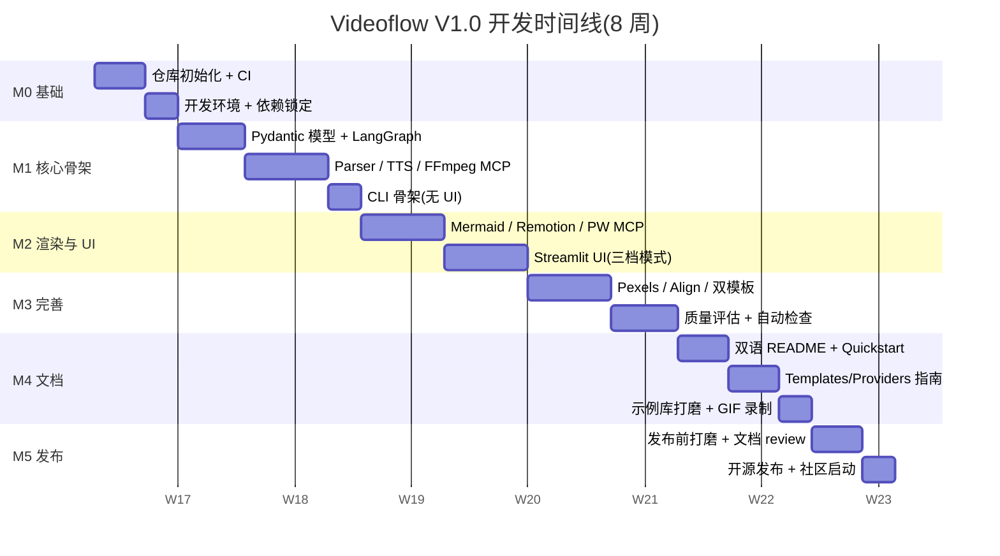

#### 10.2.2 各里程碑的详细 DoD(Definition of Done)

**M0:基础(Week 0,5 天)**

| 任务 | DoD |
|------|-----|
| 仓库初始化 | 目录结构 §9.2 全部创建;LICENSE / README stub 就位 |
| CI 骨架 | `lint` job 在 Ubuntu 上跑绿(哪怕只 lint README) |
| 开发环境文档 | 新开发者用 `make dev` 可在 30 分钟内搭好环境 |
| 依赖锁定 | `uv.lock` / `package-lock.json` 落盘 |

**M1:核心骨架(Week 1-2,10 天)**

| 任务 | DoD |
|------|-----|
| 数据模型 | `Project` / `Shot` / `ShotList` / `AssetBundle` Pydantic 定义;100% 字段测试 |
| LangGraph 主图 | 8 节点就位,SQLite checkpoint 工作,`interrupt()` 可触发 |
| `videoflow-parser` | 可将 Markdown → ShotList,explainer 模板下 90% 样本可用 |
| `videoflow-tts` | edge-tts 可生成 MP3,返回实际时长 |
| `videoflow-ffmpeg` | 单镜头合成 + concat 两个最小命令 OK |
| CLI | `generate` / `status` / `list` 三个子命令可用 |
| 里程碑成果 | **在终端里能从 input.md 跑出一个无转场、静态视觉的 MP4** |

**M2:渲染与 UI(Week 3-4,10 天)**

| 任务 | DoD |
|------|-----|
| `videoflow-mermaid` | 支持中文字体,可生成 1080×1920 PNG |
| `videoflow-remotion` | 至少 3 个 Composition(Chart / Diagram / TitleCard) |
| `videoflow-playwright` | 可录制 HTML 动画为 MP4 |
| Streamlit UI | 项目列表 + Light 审核页 + Deep 审核页(基础版) |
| 异步阻断 | CLI 提交 → Worker 挂起 → UI 点击 → Worker 继续,全流程 E2E 测试绿 |
| 里程碑成果 | **Light 模式下,用户在浏览器点一次"通过",自动出成片** |

**M3:完善(Week 5-6,9 天)**

| 任务 | DoD |
|------|-----|
| `videoflow-pexels` | 关键词搜索 + 下载,竖屏过滤 |
| `videoflow-align` | Paraformer(默认)+ whisper(备选)均可用 |
| Provider 插件机制 | Entry point 自动发现工作;新增 Provider 文档完整 |
| news_digest 模板 | 真实 3 天新闻输入均可出片 |
| 质量自动评估 | L1 结构 + L2 LLM judge + L3 规则检查三层完整 |
| 缓存机制 | 二次运行相同输入 ≥ 70% 缓存命中 |
| 里程碑成果 | **两套模板全功能可用,质量自动评估系统上线** |

**M4:文档(Week 7,8 天)**

| 任务 | DoD |
|------|-----|
| 英文 README | 首屏 GIF 就位;快速上手可运行 |
| 中文 README | 与英文等价翻译 + 本地化 |
| Quickstart 中英双语 | 新手 15 分钟内出第一条视频 |
| Templates / Providers / MCP Guide | 每份含完整示例代码 + 测试要求 |
| 《股市反常识》示例 | final.mp4 + expected_shotlist.json + 说明 |
| news_digest 3 天样例 | 真实数据 + 成片 |
| 里程碑成果 | **新用户能完全脱离作者独立上手** |

**M5:发布(Week 8,5 天)**

| 任务 | DoD |
|------|-----|
| 发布前 review | 所有测试绿 + 文档 review + 示例重跑 |
| Docker 镜像构建 | `docker compose up` 在干净机器能跑通 |
| PyPI 包发布 | `pip install videoflow` 可用 |
| GitHub Release | v1.0.0 tag + Release Notes |
| 社区启动 | Discussions 启用;作者发 1 个 Showcase;上传 Demo 视频 |

### 10.3 里程碑验收标准

每个里程碑必须通过 3 道关:

**Gate 1:自动验证**
- 所有新增单元测试跑绿
- 集成测试主链路跑绿
- CI 在 Ubuntu + macOS 双平台通过

**Gate 2:人工验证**
- 用对应的**示例输入**跑出**符合预期**的产物
- `video-agent doctor` 通过

**Gate 3:文档验证**
- 所有新增模块有文档
- CHANGELOG 更新
- 至少一个参与者按文档独立操作验证

### 10.4 V1 → V1.5 → V2 演进路线

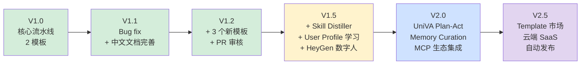

#### V1.5 重点(预计 V1.0 发布后 2-3 个月)

- **Skill Distiller**:Agent 跑完视频后异步分析用户修改习惯,沉淀 skill 到 `~/.videoflow/skills/`
- **User Profile 学习**:从显式 YAML 升级为"提议-确认"机制
- **HeyGen / Wan2.2-S2V 数字人 Provider**:支持主持人出镜
- **3-5 个新模板**:`tutorial`、`listicle`、`product_review`、`storytelling`
- **PR 审核 GUI**:模板作者友好的可视化调试工具

#### V2.0 重点(预计 V1.0 发布后 6-9 个月)

- **UniVA Plan-Act 架构**:从单 Graph 升级为多 Agent 协作
- **完整 Memory Curation**:参考 Hermes 的自 curate 机制
- **官方 Hermes 集成**:README 级别的 first-class 支持
- **生成式视频 Provider**:LTX-2.3 / Wan2.2 作为 B-roll 补位
- **Asset Indexing + embedding 复用**(参考 ViMax)
- **OpenHarness 风格权限系统**

---

## 第十一部分 · 风险与应对

### 11.1 风险矩阵

```
        可能性
          高│   R1  R2        R4
            │
          中│        R3   R6
            │
          低│              R5  R7   R8
            ├──────────────────────────
              低    中    高   严重
                   影响
```

| # | 风险 | 可能性 | 影响 | 应对 |
|---|------|-------|------|------|
| R1 | Remotion 跨语言调度不稳定 | 高 | 低 | 预留 Playwright 降级路径 |
| R2 | 中文字体在不同平台差异 | 高 | 低 | 打包 Noto CJK SC,强制指定路径 |
| R3 | LangGraph interrupt 机制使用困难 | 中 | 中 | M1 提前 POC,团队内分享 |
| R4 | MCP 协议快速演进破坏兼容 | 高 | 高 | 锁定版本 + 每月升级评审 |
| R5 | 社区冷启动用户稀少 | 低 | 高 | 首发配 Demo 视频 + Hacker News / Reddit 推广 |
| R6 | 外部 API 限流(Claude / Pexels) | 中 | 中 | LiteLLM fallback 链 + 本地 Ollama 备选 |
| R7 | FFmpeg 在 Windows 原生支持差 | 低 | 严重 | 明确只支持 WSL2 + Docker;文档强提示 |
| R8 | 开源合规(Remotion 企业许可) | 低 | 严重 | README 顶部显著标注 |

### 11.2 技术风险详解

#### R1. Remotion 跨语言调度不稳定

**场景**:Python subprocess 调 `npx remotion render`,在某些环境(Windows WSL、Docker)下 subprocess 挂死或返回错误。

**应对**:
- MCP Server 设 300 秒硬超时,超时自动杀进程
- 为每个 Composition 准备 Playwright 降级实现(同样的 props,HTML/CSS 实现)
- 配置开关 `rendering.fallback_to_playwright = true`
- 监控:如果 Remotion 连续 3 次失败,自动切到 Playwright

#### R3. LangGraph interrupt 机制

**场景**:团队不熟悉 LangGraph 的 `interrupt()`,实现错误导致 Worker 无法正确恢复。

**应对**:
- M0 阶段做 POC:一个最简 demo 证明 CLI → interrupt → Streamlit 通信 → 恢复 工作
- 所有 interrupt 节点走统一的 base class,减少重复错误
- E2E 测试覆盖 interrupt 恢复场景

#### R4. MCP 协议破坏性变更

**场景**:MCP 标准处于快速演进期,升级可能破坏 Videoflow 的 client / server。

**应对**:
- `mcp` 包在 `pyproject.toml` 中锁定版本范围(如 `>=1.0,<2.0`)
- 每月评审 MCP 最新 release note
- 所有 MCP 调用经过 `videoflow/mcp_client/` 统一封装,升级影响收敛到一处
- 维护一个 MCP 兼容性矩阵文档

### 11.3 开源社区风险

#### R5. 冷启动

**挑战**:开源视频生成项目多,Videoflow 如何脱颖而出?

**应对**:
- **首发必须有杀手锏 Demo**:《股市反常识》成品视频放 README 首屏
- **立场鲜明的差异化表达**:明确"我们不做电影级,不做数字人,就是要精准图表"
- **技术博客**:发布时配 1 篇深度技术博客,讲 LangGraph + MCP + FFmpeg 如何组合
- **曝光渠道**:Hacker News "Show HN"、Reddit r/LocalLLaMA、Product Hunt、V2EX、掘金
- **目标用户种子**:先找 5-10 个真实的科普类视频作者,邀请内测

#### 长期维护投入

**应对**:
- 明确标注 "Hobby project, no SLA";不承诺商业级支持
- 核心架构设计鼓励社区贡献(Provider / Template 可独立贡献,不需理解核心)
- 使用 `good first issue` 标签培育贡献者

### 11.4 合规风险

#### Pexels 素材使用

Pexels License 允许商用,但要求:
- 不得暗示被拍摄人物代言
- 某些识别度高的场景需额外审核
- Videoflow 在 README 明确:用户使用 Pexels 素材自行承担责任

#### BGM 版权

- V1 不内置任何 BGM,用户必须自备
- 配置文件注释明确提示:确保你对 BGM 有合法使用权
- 未来若引入 BGM 库,仅使用 Creative Commons 0 素材

#### 自动发布到抖音 / YouTube

- 抖音开放平台条款对自动化发布有严格要求
- V1 明确不做,规避灰色地带
- V2 若实现,先在 `docs/legal.md` 写清适用范围

---

## 第十二部分 · 附录

### 附录 A · 《股市反常识》实战样例

本附录展示从用户输入到成品视频的完整流程,作为:
- MVP 开发的验收依据
- 新用户的参考样本
- 模板作者的学习素材
- E2E 测试的标准输入

#### A.1 原始 Markdown 文案

保存为 `examples/explainer-stock-myths/input.md`:

```markdown
---
title: 公司赚的钱跟散户有什么关系
category: 金融科普
target_duration: 60
---

# 公司赚的钱,其实跟你没关系

## 一个反常识的事实

你买了茅台的股票,茅台去年赚了 740 亿。你拿到多少?答案可能让你失望。

## 钱流向哪里

散户买单,钱从你的账户流向二级市场的成交价格,最后进到卖方口袋——
这个卖方可能是早期股东、机构、或者上一个散户。

公司本身呢?除了 IPO 和增发那一次拿到钱,平时一分都不进公司账上。

## 分红的真相

A 股平均股息率 1.8%,港股 3.5%,美股 6.2%。
你买 A 股,靠分红回本要 55 年。

## 你赚的其实是谁的钱

你赚的不是公司的钱。你赚的是**下一个散户**的钱。
二级市场本质是"交易预期",不是"分利润"。

## 为什么这套机制不崩

因为有四股力量在维护:政策鼓励、媒体渲染、券商营销、暴富故事。
只要还有新散户相信"未来会涨",接力就不会断。

---

思考:如果没有新资金进场,这个游戏能玩多久?
```

#### A.2 LangExtract 产出的 ShotList JSON

期望输出(`expected_shotlist.json`,用于回归测试):

```json
{
  "version": "1",
  "project_id": "example_stock_myths",
  "template": "explainer",
  "target_duration": 60,
  "style_preset": "explainer_dark",
  "shots": [
    {
      "shot_id": "S01",
      "start": 0,
      "end": 6.5,
      "narration": "你买了茅台的股票,茅台去年赚了 740 亿。你拿到多少?",
      "visual": {
        "type": "title_card",
        "text": "公司赚的钱\n跟你没关系?",
        "background": "dark",
        "highlight_keywords": ["没关系"]
      },
      "renderer": "remotion",
      "subtitle_style": "highlight_keyword",
      "tts_voice": "zh-CN-YunxiNeural"
    },
    {
      "shot_id": "S02",
      "start": 6.5,
      "end": 22.0,
      "narration": "散户买单,钱从你的账户流进二级市场,最后进到卖方口袋。公司本身,除了 IPO 那一次,平时一分都不进公司账上。",
      "visual": {
        "type": "diagram",
        "mermaid_code": "graph LR\n  A[散户买单] --> B[二级市场<br/>成交价格]\n  B --> C[卖方口袋]\n  D[公司账户] -.X.-> B\n  style A fill:#ffcdd2\n  style C fill:#c8e6c9\n  style D fill:#cfd8dc,stroke-dasharray:5 5"
      },
      "renderer": "remotion",
      "subtitle_style": "default"
    },
    {
      "shot_id": "S03",
      "start": 22.0,
      "end": 35.0,
      "narration": "看分红率,A 股平均 1.8%,港股 3.5%,美股 6.2%。你买 A 股靠分红回本要 55 年。",
      "visual": {
        "type": "chart",
        "chart_type": "bar",
        "title": "股息率对比",
        "data": {
          "labels": ["A 股", "港股", "美股"],
          "values": [1.8, 3.5, 6.2],
          "unit": "%"
        },
        "color_scheme": "diverging_red_green",
        "animation_anchors": [
          {"keyword": "A 股", "action": "highlight_bar", "bar_index": 0},
          {"keyword": "美股", "action": "highlight_bar", "bar_index": 2}
        ]
      },
      "renderer": "remotion"
    },
    {
      "shot_id": "S04",
      "start": 35.0,
      "end": 45.0,
      "narration": "你赚的不是公司的钱,你赚的是下一个散户的钱。二级市场的本质是交易预期,不是分利润。",
      "visual": {
        "type": "diagram",
        "mermaid_code": "graph TB\n  A[散户 1] -->|买入| B[价格]\n  B -->|卖出| A\n  C[散户 2] -->|买入| D[更高价格]\n  D -->|卖出| C\n  E[散户 3] -->|买入| F[更高价格]\n  F -->|卖出| E"
      },
      "renderer": "remotion",
      "notes": "接力金字塔结构"
    },
    {
      "shot_id": "S05",
      "start": 45.0,
      "end": 56.0,
      "narration": "为什么这套机制不崩?因为政策鼓励、媒体渲染、券商营销、暴富故事——四股力量在维护。",
      "visual": {
        "type": "diagram",
        "mermaid_code": "graph TB\n  center((信念机制))\n  A[政策鼓励] --> center\n  B[媒体渲染] --> center\n  C[券商营销] --> center\n  D[暴富故事] --> center"
      },
      "renderer": "remotion"
    },
    {
      "shot_id": "S06",
      "start": 56.0,
      "end": 62.0,
      "narration": "思考:如果没有新资金进场,这个游戏能玩多久?",
      "visual": {
        "type": "title_card",
        "text": "没有新资金进场,\n这个游戏能玩多久?",
        "background": "dark",
        "highlight_keywords": ["多久"]
      },
      "renderer": "remotion",
      "subtitle_style": "default"
    }
  ]
}
```

#### A.3 每个 Shot 的画面描述与预期效果

| Shot | 画面类型 | 视觉要点 | 时长 |
|------|---------|---------|------|
| S01 | 标题卡 | 深色背景,两行白字,"没关系"三字红色高亮,轻微缩放入场 | 6.5s |
| S02 | 动画流程图 | 三个节点依次出现,箭头流动;"公司账户"用虚线+叉号表示"不参与" | 15.5s |
| S03 | 动画柱状图 | 三条柱从 0 增长到目标值;"A 股"和"美股"高亮红绿对比 | 13.0s |
| S04 | 接力金字塔 | 三个散户依次出现,箭头显示买卖关系 | 10.0s |
| S05 | 四方辐射图 | 中心节点展开,四条射线依次亮起 | 11.0s |
| S06 | 结尾标题卡 | 深色背景,问句居中,"多久"字符跳动 | 6.0s |

**总时长**:62 秒(目标 60 秒,偏差 3.3%,通过 L1 检查)

#### A.4 时间轴与音频对齐表

TTS 生成后实际音频对齐:

| Shot | 旁白文本 | 预计时长 | 实际时长(YunxiNeural) | SRT 起止 |
|------|---------|---------|----------------------|---------|
| S01 | 你买了茅台的股票... | 6.5s | 6.3s | 00:00.00 → 00:06.30 |
| S02 | 散户买单,钱从... | 15.5s | 15.1s | 00:06.30 → 00:21.40 |
| S03 | 看分红率,A 股... | 13.0s | 12.8s | 00:21.40 → 00:34.20 |
| S04 | 你赚的不是公司的钱... | 10.0s | 9.8s | 00:34.20 → 00:44.00 |
| S05 | 为什么这套机制不崩... | 11.0s | 11.2s | 00:44.00 → 00:55.20 |
| S06 | 思考:如果没有新资金... | 6.0s | 6.5s | 00:55.20 → 01:01.70 |
| | | **62.0s** | **61.7s** | |

**关键对齐锚点**(Paraformer 提取):

- S03:"A 股" 出现在 22.4s → 触发第一条柱高亮
- S03:"美股" 出现在 31.1s → 触发第三条柱高亮

#### A.5 FFmpeg 合成命令完整展开

**Step 1:每个 Shot 单独合成**

```bash
# S02 (动态视觉)
ffmpeg -y \
  -i workspace/proj_example/assets/S02.mp4 \
  -i workspace/proj_example/audio/S02.mp3 \
  -vf "subtitles=workspace/proj_example/audio/S02.ass:fontsdir=assets/fonts" \
  -c:v libx264 -preset medium -crf 23 \
  -c:a aac -b:a 192k \
  -map 0:v -map 1:a \
  -shortest \
  workspace/proj_example/scenes/S02.mp4
```

**Step 2:生成 concat filelist**

```
# workspace/proj_example/scenes/filelist.txt
file 'S01.mp4'
file 'S02.mp4'
file 'S03.mp4'
file 'S04.mp4'
file 'S05.mp4'
file 'S06.mp4'
```

**Step 3:xfade 转场拼接**(简化,连续调用)

```bash
# 两两 xfade,循环直到合并完
ffmpeg -y \
  -i S01.mp4 -i S02.mp4 \
  -filter_complex "\
    [0:v][1:v]xfade=transition=fade:duration=0.5:offset=6.0[v]; \
    [0:a][1:a]acrossfade=d=0.5[a]" \
  -map "[v]" -map "[a]" \
  -c:v libx264 -c:a aac \
  tmp_S01_02.mp4

# ... 继续
```

**Step 4:最终导出(抖音优化)**

```bash
ffmpeg -y \
  -i workspace/proj_example/scenes/concat.mp4 \
  -c:v libx264 -profile:v high -level 4.0 \
  -preset slow -crf 20 \
  -pix_fmt yuv420p \
  -c:a aac -b:a 192k -ar 44100 \
  -movflags +faststart \
  -r 30 \
  workspace/proj_example/final.mp4
```

#### A.6 最终成片说明

- 文件:`examples/explainer-stock-myths/final.mp4`
- 规格:1080 × 1920, H.264 high profile, 30fps, AAC 192k
- 时长:61.7 秒
- 文件大小:~ 15-20 MB
- 首帧缩略图:`examples/explainer-stock-myths/thumbnail.png`

> MVP 完成后,本节补充实际截图和 GIF。

---

### 附录 B · 开源项目对比一览表

PRD 讨论中参考过的项目完整对比:

| 项目 | 分类 | 星数 | 语言 | 对 Videoflow 的贡献 |
|------|------|-----|------|------------------|
| LangGraph | Agent 框架 | — | Python | ✅ 编排层主干 |
| LangExtract | 结构化抽取 | — | Python | ✅ 脚本解析 |
| LiteLLM | LLM 抽象 | — | Python | ✅ Provider 抽象底座 |
| MCP | 工具协议 | — | Multi | ✅ 工具插件协议 |
| Remotion | 视频框架 | 21k+ | TS | ✅ 动态视觉渲染 |
| FunClip / FunASR | ASR 工具 | 3.4k+ | Python | ✅ 中文字幕对齐 |
| edge-tts | TTS | 3k+ | Python | ✅ 默认 TTS |
| faster-whisper | STT | 10k+ | Python | ✅ 字幕对齐备选 |
| MoneyPrinterTurbo | 短视频生成 | 47k | Python | ⚠️ Pipeline 范式参考,方向不同 |
| NarratoAI | 视频解说 | 2.6k+ | Python | ⚠️ 方向反向,不采用 |
| ViMax | 叙事视频 | 2.5k | Python | ⚠️ 架构参考,目标不同 |
| UniVA | 多 Agent 视频 | — | Python | 🔮 V2 升级参考 |
| MotionAgent | 剧本→视频 | — | Python | ❌ 不采用 |
| Hermes Agent | 个人助理 | 8.7k | Python | 🔮 V2 集成参考 |
| OpenAI Agents SDK | Agent 框架 | 18.9k | Python | ⚠️ 评估后不采用 |
| OpenHarness | Agent 基础设施 | 10.2k | Python | ⚠️ 权限机制参考 |
| OpenClaw | Agent 运行时 | — | Python | ⚠️ Skill 标准参考 |
| Pexels API | 库存素材 | — | — | ✅ 默认 Stock Provider |
| Mermaid CLI | 图表渲染 | — | JS | ✅ 流程图渲染 |
| Playwright | 浏览器自动化 | — | TS | ✅ HTML 录屏 |
| FFmpeg | 视频处理 | — | C | ✅ 合成核心 |
| Streamlit | Web UI | — | Python | ✅ 审核 UI |

### 附录 C · 完整技术栈清单与 License 审计表

| 组件 | 版本范围 | License | 商业使用 | 备注 |
|------|---------|---------|---------|------|
| Python | 3.11+ | PSF | ✅ | — |
| Node.js | 20+ | MIT | ✅ | — |
| FFmpeg | 6.0+ | LGPL(默认) | ✅ 动态链接 | 不启用 GPL 编码器 |
| LangGraph | latest | MIT | ✅ | — |
| LangExtract | latest | Apache 2.0 | ✅ | — |
| LiteLLM | latest | MIT | ✅ | — |
| MCP SDK | 1.x | MIT | ✅ | — |
| Remotion | 4+ | 企业许可阈值 $1M | ⚠️ 大公司需购买 | README 明示 |
| Mermaid | 10+ | MIT | ✅ | — |
| Playwright | 1.x | Apache 2.0 | ✅ | — |
| edge-tts | latest | MIT | ✅ | — |
| FunASR | latest | Apache 2.0 | ✅ | — |
| faster-whisper | latest | MIT | ✅ | — |
| Streamlit | 1.x | Apache 2.0 | ✅ | — |
| Pydantic | 2.x | MIT | ✅ | — |
| SQLite | 3 | Public Domain | ✅ | — |
| uv | latest | MIT | ✅ | — |
| Noto Sans CJK SC | — | SIL OFL 1.1 | ✅ 可打包 | — |
| Inter | — | SIL OFL 1.1 | ✅ 可打包 | — |

### 附录 D · 完整 Pydantic Schema 代码

```python
# src/videoflow/models/shot.py
from datetime import datetime
from enum import Enum
from pathlib import Path
from typing import Literal, Union

from pydantic import BaseModel, Field


class Renderer(str, Enum):
    MERMAID = "mermaid"
    REMOTION = "remotion"
    PLAYWRIGHT = "playwright"
    STATIC = "static"


class ReviewMode(str, Enum):
    AUTO = "auto"
    LIGHT = "light"
    DEEP = "deep"


class ProjectStatus(str, Enum):
    CREATED = "CREATED"
    PARSING = "PARSING"
    WAITING_REVIEW_1 = "WAITING_REVIEW_1"
    GENERATING_ASSETS = "GENERATING_ASSETS"
    GENERATING_TTS = "GENERATING_TTS"
    ALIGNING_SUBTITLE = "ALIGNING_SUBTITLE"
    WAITING_REVIEW_2 = "WAITING_REVIEW_2"
    COMPOSING = "COMPOSING"
    WAITING_REVIEW_3 = "WAITING_REVIEW_3"
    DONE = "DONE"
    FAILED = "FAILED"


# --- VisualSpec 多态 ---

class AnimationAnchor(BaseModel):
    keyword: str
    action: str          # "highlight_bar", "fade_in_element", ...
    bar_index: int | None = None
    element_id: str | None = None
    time_offset: float | None = None


class ChartVisual(BaseModel):
    type: Literal["chart"] = "chart"
    chart_type: Literal["bar", "line", "pie", "scatter"]
    title: str | None = None
    data: dict
    color_scheme: str = "default"
    animation_anchors: list[AnimationAnchor] = []


class DiagramVisual(BaseModel):
    type: Literal["diagram"] = "diagram"
    mermaid_code: str
    animation_mode: Literal["static", "sequential"] = "sequential"


class TitleCardVisual(BaseModel):
    type: Literal["title_card"] = "title_card"
    text: str
    background: str = "dark"
    highlight_keywords: list[str] = []


class StockFootageVisual(BaseModel):
    type: Literal["stock_footage"] = "stock_footage"
    query: str
    orientation: Literal["portrait", "landscape", "square"] = "portrait"
    fallback_to: str | None = None


class ScreenCaptureVisual(BaseModel):
    type: Literal["screen_capture"] = "screen_capture"
    url: str
    selector: str | None = None
    interactions: list[dict] = []


class ImageVisual(BaseModel):
    type: Literal["image"] = "image"
    path: Path
    ken_burns: bool = True


VisualSpec = Union[
    ChartVisual,
    DiagramVisual,
    TitleCardVisual,
    StockFootageVisual,
    ScreenCaptureVisual,
    ImageVisual,
]


# --- Shot ---

class Shot(BaseModel):
    shot_id: str = Field(pattern=r"^S\d{2,}$")
    start: float = Field(ge=0)
    end: float = Field(ge=0)
    narration: str = Field(min_length=1)
    visual: VisualSpec = Field(discriminator="type")
    renderer: Renderer
    subtitle_style: str = "default"
    tts_voice: str | None = None
    tts_speed: float | None = Field(default=None, ge=0.5, le=2.0)

    # 中间产物(执行时填充)
    audio_file: Path | None = None
    visual_file: Path | None = None
    subtitle_file: Path | None = None

    # 元信息
    source_span: tuple[int, int] | None = None
    notes: str | None = None


class AudioTimelineEntry(BaseModel):
    shot_id: str
    audio_file: Path
    start: float
    end: float
    subtitle_file: Path


class ShotList(BaseModel):
    version: Literal["1"] = "1"
    project_id: str
    template: str
    target_duration: int
    actual_duration: float | None = None

    shots: list[Shot]
    audio_timeline: list[AudioTimelineEntry] | None = None
    style_preset: str = "default"
    bgm_path: Path | None = None


# --- Project ---

class Project(BaseModel):
    project_id: str = Field(pattern=r"^proj_[a-z0-9]{8}$")
    created_at: datetime
    updated_at: datetime

    input_text: str
    input_path: Path | None = None
    template: str
    review_mode: ReviewMode
    target_duration: int = 60

    status: ProjectStatus
    current_node: str | None = None
    error: str | None = None

    output_path: Path | None = None
    thumbnail_path: Path | None = None

    config_snapshot: dict = {}
```

### 附录 E · FFmpeg 命令参考手册

核心命令模板摘要(详细见 §6.7):

**F1. 静态背景 + 音频 + 字幕**

```bash
ffmpeg -y \
  -loop 1 -t {duration} -i {visual.png} \
  -i {audio.mp3} \
  -vf "subtitles={subtitle.ass}:fontsdir={fonts_dir}" \
  -c:v libx264 -preset medium -crf 23 -pix_fmt yuv420p \
  -c:a aac -b:a 192k \
  -shortest \
  {output.mp4}
```

**F2. 动态背景 + 音频 + 字幕**

```bash
ffmpeg -y \
  -i {visual.mp4} \
  -i {audio.mp3} \
  -vf "subtitles={subtitle.ass}:fontsdir={fonts_dir}" \
  -c:v libx264 -preset medium -crf 23 \
  -c:a aac -b:a 192k \
  -map 0:v -map 1:a \
  -shortest \
  {output.mp4}
```

**F3. 简单 concat(无转场)**

```bash
# filelist.txt
# file 'S01.mp4'
# file 'S02.mp4'

ffmpeg -y -f concat -safe 0 -i filelist.txt -c copy {output.mp4}
```

**F4. xfade 转场**

```bash
ffmpeg -y \
  -i A.mp4 -i B.mp4 \
  -filter_complex "\
    [0:v][1:v]xfade=transition=fade:duration=0.5:offset={A_dur - 0.5}[v]; \
    [0:a][1:a]acrossfade=d=0.5[a]" \
  -map "[v]" -map "[a]" \
  -c:v libx264 -c:a aac \
  {output.mp4}
```

**F5. 添加 BGM**

```bash
ffmpeg -y \
  -i {input.mp4} -i {bgm.mp3} \
  -filter_complex "\
    [1:a]volume={bgm_vol},aloop=loop=-1:size=2e+09[bgm]; \
    [0:a][bgm]amix=inputs=2:duration=first:dropout_transition=2[aout]" \
  -map 0:v -map "[aout]" \
  -c:v copy -c:a aac -b:a 192k \
  {output.mp4}
```

**F6. 最终导出(抖音优化)**

```bash
ffmpeg -y -i {input.mp4} \
  -c:v libx264 -profile:v high -level 4.0 -preset slow -crf 20 \
  -pix_fmt yuv420p \
  -c:a aac -b:a 192k -ar 44100 \
  -movflags +faststart -r 30 \
  {output.mp4}
```

**F7. 时长检测(ffprobe)**

```bash
ffprobe -v error -show_entries format=duration \
  -of default=noprint_wrappers=1:nokey=1 {input.mp4}
```

**F8. 黑帧检测**

```bash
ffmpeg -i {input.mp4} -vf blackdetect=d=0.5:pic_th=0.98 -f null - 2>&1 \
  | grep blackdetect
```

### 附录 F · 术语中英对照表(为英文 PRD 铺路)

| 中文 | English | 备注 |
|------|---------|------|
| 分镜 | Shot | — |
| 场景 | Scene | 多 Shot 组合 |
| 项目 | Project | — |
| 模板 | Template | — |
| 执行器 | Executor | — |
| 提供商插件 | Provider | — |
| 渲染器 | Renderer | — |
| 检查点 | Checkpoint | — |
| 中断 | Interrupt | LangGraph 术语 |
| 审核 | Review | — |
| 分镜稿 | ShotList / Script Storyboard | — |
| 素材包 | AssetBundle | — |
| 音画同步 | Audio-Visual Sync | — |
| 强制对齐 | Forced Alignment | 字幕技术 |
| 转场 | Transition | — |
| 静音段 | Silence Gap | — |
| 工作区 | Workspace | — |
| 声先画后 | Audio-first / Visual follows | 设计原则 |
| 声线 | Voice | TTS 术语 |
| 硬字幕 | Burned-in Subtitle | 烧录在视频中的字幕 |
| 轻审核 | Light Review | 三档审核之一 |
| 深度审核 | Deep Review | 三档审核之一 |
| 全自动 | Auto Mode | 三档审核之一 |
| 状态机 | State Machine | — |
| 幂等 | Idempotent | — |
| 流水线 | Pipeline | — |

### 附录 G · 参考资料与致谢

#### G.1 核心依赖项目

- [LangGraph](https://github.com/langchain-ai/langgraph)
- [LangExtract](https://github.com/google/langextract)
- [Remotion](https://github.com/remotion-dev/remotion)
- [Mermaid](https://github.com/mermaid-js/mermaid)
- [FunASR](https://github.com/modelscope/FunASR)
- [edge-tts](https://github.com/rany2/edge-tts)
- [faster-whisper](https://github.com/SYSTRAN/faster-whisper)
- [LiteLLM](https://github.com/BerriAI/litellm)
- [FFmpeg](https://ffmpeg.org/)
- [MCP Protocol](https://modelcontextprotocol.io)

#### G.2 架构参考

- [UniVA: Universal Video Agent](https://arxiv.org/abs/2511.08521) — Plan-Act 架构启发
- [ViMax: Agentic Video Generation](https://github.com/HKUDS/ViMax) — 九层 Pipeline 启发
- [MoneyPrinterTurbo](https://github.com/harry0703/MoneyPrinterTurbo) — 工程实践参考
- [OpenHarness](https://github.com/HKUDS/OpenHarness) — Harness 工程实践
- [Hermes Agent](https://github.com/NousResearch/hermes-agent) — Skill 自学习理念

#### G.3 致谢

Videoflow 站在众多开源项目的肩膀上。本项目不直接使用以上项目的代码(除了作为依赖的部分),但吸收了它们的架构思想、工程实践、命名规范。特此致谢所有作者与贡献者。

本 PRD 的设计过程参考了:

- Anthropic 《Building Effective Agents》
- Martin Fowler《Harness Engineering》
- LangChain Blog《The Anatomy of an Agent Harness》

---

# PRD 中文版完整结束

**文档结构回顾**:

| 部分 | 章节 | 主要内容 |
|------|------|---------|
| 0 | 前置信息 | 术语、阅读指南 |
| 1 | 产品概述 | 背景、愿景、MVP 范围 |
| 2 | 设计原则 | 六条原则、NFR、技术栈总表 |
| 3 | 系统架构 | 架构图、分层、部署拓扑 |
| 4 | 数据模型 | Project、Shot、ShotList 完整定义 |
| 5 | 业务流程 | 主流程、LangGraph、三档审核、时序 |
| 6 | 模块详细设计 | 入口层、编排、MCP、Provider、UI、FFmpeg |
| 7 | 工程细节 | 音画同步、字体、跨语言、并行、缓存、配置 |
| 8 | 测试 | 单元、集成、质量评估、CI/CD |
| 9 | 开源发布 | License、仓库结构、文档、示例、社区 |
| 10 | 里程碑 | 8 周计划、验收标准、V1.5/V2 演进 |
| 11 | 风险 | 风险矩阵、详细应对 |
| 12 | 附录 | 实战样例、对比表、Schema、FFmpeg 手册、术语表 |

**下一步**:

- 定稿本中文版 PRD 后,翻译输出英文版(`PRD_en.md`)
- 英文版完成后,可考虑发布到 GitHub 仓库的 `docs/` 目录作为架构参考
- 开始 M0 阶段的仓库初始化

**文档元信息**:
- 中文版本号:v0.1
- 总字数(中文 + 代码):约 45,000 字
- 图表总数:20+(含 Mermaid / ASCII / 表格)
- 代码示例:50+ 处
- 三卷分别约 1,280 / 2,210 / 2,100 行
